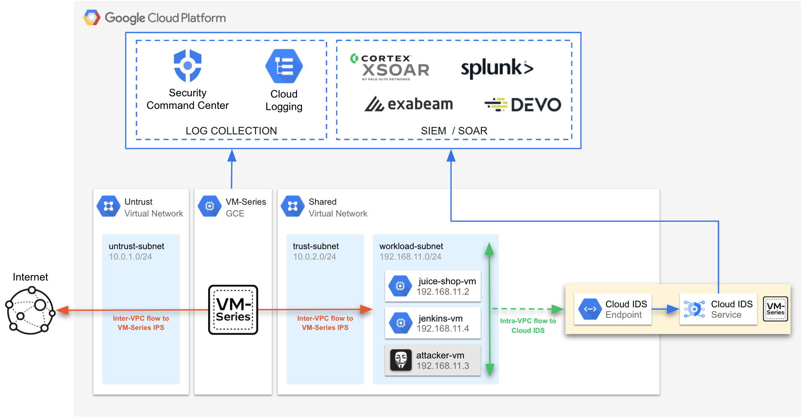

# Google Cloud VM-Series Architecture Demos
## Overview
The purpose of this directory is to provide resources to quickly deploy and learn about various VM-Series architectures in Google Cloud.  The builds in this directory are completely independent of one another.  All of the builds use Terraform 1.0.x and use either the Google CLoud Terraform provider resources or the modules listed [here](https://github.com/wwce/google-cloud-vmseries-builds/tree/main/modules). 

## Architectures
Below is a summary of the builds to help you select the best architecture for your use-case.   A full deployment guide is included as part of the README.md in each build directory.

### VM-Series & Global VPC
This [build](https://github.com/wwce/google-cloud-vmseries-builds/tree/main/blueprints/vmseries-global-vpc) demonstrates how to use Google Cloud network tags to steer outbound traffic to internal TCP/UDP load balancers that frontend regionally distributed VM-Series firewalls.  

    

### VM-Series & Cloud IDS

This [build](https://github.com/wwce/google-cloud-vmseries-builds/tree/main/blueprints/vmseries-cloud-ids) demonstrates how to use the VM-Series firewall and Google Cloud IDS to provide a layered security approach for a single VPC network.  VM-Series firewalls are positioned to provide north-south prevention controls and Cloud IDS provides intra-VPC (east/west) threat detection.

    

### VM-Series & Hub and Spoke - VPC Peering
This [build](https://github.com/wwce/google-cloud-vmseries-builds/tree/main/blueprints/vmseries-hub-spoke) demonstrates how to use a common set of VM-Series firewalls to secure internet inbound, internet outbound, and east-west traffic for a Google Cloud hub and spoke architecture.  This build focuses on how various traffic flows traverse through the VM-Series firewall (or hub) for Google peered VPC networks (or spokes).  You will also learn how to leverage Google Cloud network load balancers to provide horizontal scale and cross zonal redundancy to your own VM-Series deployments. 

    

### VM-Series & Hub and Spoke - Autoscale
This build is the same as the **VM-Series Hub and Spoke - Common Firewalls**, except the VM-Series firewalls are deployed into a Google Cloud managed instance group.  The managed instance group provides the VM-Series the ability to automatically scale based on PAN-OS delievered metrics to Google StackDriver.  

**Note:  You will need a Panorama instance for this build**

    

## Support Policy
This solution is released under an as-is, best effort, support policy. These scripts should be seen as community supported and Palo Alto Networks will contribute our expertise as and when possible. We do not provide technical support or help in using or troubleshooting the components of the project through our normal support options such as Palo Alto Networks support teams, or ASC (Authorized Support Centers) partners and backline support options. The underlying product used (the VM-Series firewall) by the scripts or templates are still supported, but the support is only for the product functionality and not for help in deploying or using the template or script itself.
