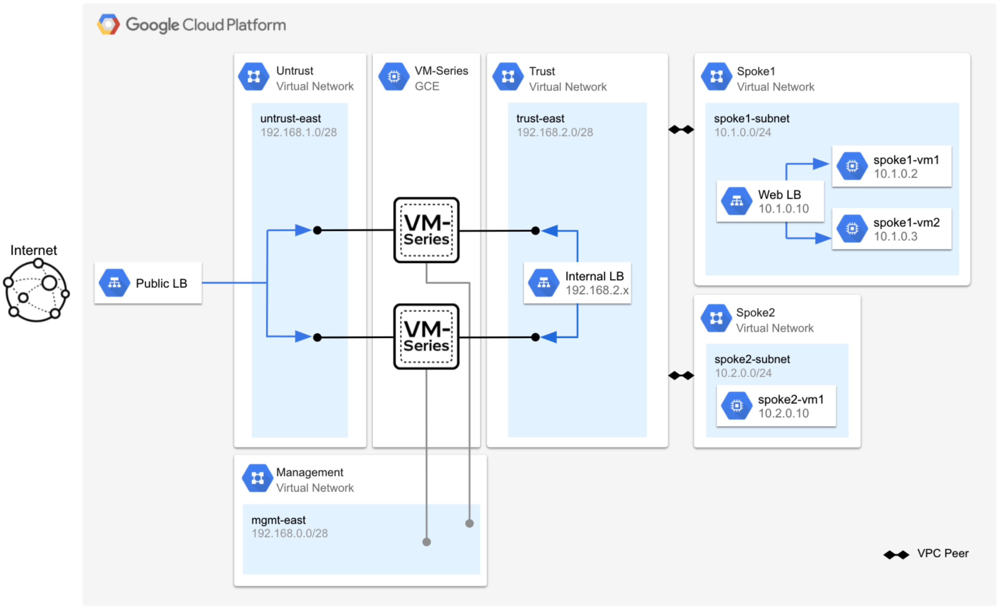

## VM-Series Blueprints & Terraform Modules for Google Cloud

### Overview
The purpose of this repo is to provide guidance on different VM-Series architectures in Google Cloud and how to deploy them using Terraform.  The [blueprints](https://github.com/wwce/google-cloud-vmseries-builds/tree/main/blueprints) directory contains a list of various architectures with complete build guides.  The blueprints use the Terraform modules listed in the [modules](https://github.com/wwce/google-cloud-vmseries-builds/tree/main/modules) directory. 

### Blueprints
Below is a summary of the blueprints to help select the best architecture for your use-case.   

#### VM-Series Global VPC Blueprint
In this [blueprint](https://github.com/wwce/google-cloud-vmseries-builds/tree/main/blueprints/vmseries-global-vpc), VM-Series firewalls are deployed to secure north/south traffic for a single VPC network.  The build provides guidance on how to leverage network tags to steer traffic to specific internal TCP/UDP load balancers that frontend VM-Series firewalls.  Network tags have a variety of use-cases, including:  

* Prevention of cross-region traffic flows.
* Isolation of egress traffic between development and production environments.
* Creation of “swimming-lanes” to distribute traffic to different sets of load balanced firewalls.

    

#### VM-Series Hub and Spoke Blueprint

This [blueprint](https://github.com/wwce/google-cloud-vmseries-builds/tree/main/blueprints/vmseries-hub-spoke-vpc-peering), demonstrates how to secure internet inbound, internet outbound, and east-west traffic using VPC peering. This build focuses on how traffic flows through the VM-Series firewall (or hub).  You will also learn how to leverage Google Cloud network load balancers to provide horizontal scale and redundancy to your VM-Series deployments. 

    

#### VM-Series Hub and Spoke with Autoscale Blueprint
This [blueprint's](https://github.com/wwce/google-cloud-vmseries-builds/tree/main/blueprints/vmseries-hub-spoke-autoscale) network topology is identical to hub and spoke with VPC peering topology.  However, this blueprint deploys the VM-Series through a launch template and into a managed instance group. The managed instance group provides the ability to automatically scale based on PAN-OS metrics delivered to Google StackDriver.

    

#### VM-Series Multi-NIC Blueprint

This [blueprint](https://github.com/wwce/google-cloud-vmseries-builds/tree/main/blueprints/vmseries-hub-spoke-multi-nic), demonstrates how to secure internet inbound, internet outbound, and east-west traffic for two VPC networks using a multi-NIC VM-Series topology.  This topology is ideal for environments where VPC peering cannot be used.

    

#### VM-Series & Cloud IDS Blueprint

This [blueprint](https://github.com/wwce/google-cloud-vmseries-builds/tree/main/blueprints/vmseries-cloud-ids) demonstrates how to use the VM-Series firewall and Google Cloud IDS to provide a layered security approach for a single VPC network.  VM-Series firewalls are positioned to provide north-south prevention controls and Cloud IDS provides intra-VPC (east/west) threat detection.

    

## Support Policy
This solution is released under an as-is, best effort, support policy. These scripts should be seen as community supported and Palo Alto Networks will contribute our expertise as and when possible. We do not provide technical support or help in using or troubleshooting the components of the project through our normal support options such as Palo Alto Networks support teams, or ASC (Authorized Support Centers) partners and backline support options. The underlying product used (the VM-Series firewall) by the scripts or templates are still supported, but the support is only for the product functionality and not for help in deploying or using the template or script itself.
