# VM-Series Autoscaling with Google Cloud Managed Instance Groups


## Overview

Palo Alto Networks VM-Series ML-NGFW is the industry-leading virtualized security platform to protect applications and data with next-generation security features in Google Cloud.  This build provides guidance on how to leverage Google Cloud managed instance groups and load balancers to autoscale VM-Series firewalls.  Please note, this build requires an existing Panorama appliance (virtual or physical) to bootstrap the VM-Series firewalls.  Panorama provides operational efficiency by centralizing the policy and logging for the autoscaled VM-Series firewalls. We will walk through the baseline configuration of the Panorama device group and template stack.


### Build Objectives 

* Review Google Cloud and VM-Series autoscale architecture.
* Walk through of Panorama baseline setup for VM-Series firewalls.
* Build the environment using Terraform by Hashicorp.
* Configure VM-Series NAT policies to secure internet inbound and outbound traffic.
* Configure generic VM-Series security policies to secure north/south and east/west traffic.
* View and modify PAN-OS metrics delivered to Google Cloud Stackdriver.  


### Topology

The diagram below shows the lab environment we will be building.  Everything depicted in the diagram is built through Terraform. All traffic to/from the spoke VPC networks flows through the VM-Series firewalls for inspection. The VM-Series is deployed into a managed instance group.  This provides the VM-Series the ability to horizontally scale based on PAN-OS metrics delivered to Google Stackdriver.  This build requires an existing Panorama appliance because the VM-Series bootstrap to Panorama to receive their configuration.  

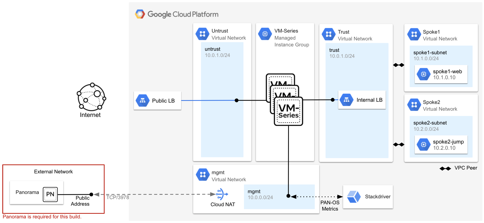

<table>
  <tr>
   <td><strong>VPC Network</strong>
   </td>
   <td><strong>Purpose</strong>
   </td>
  </tr>
  <tr>
   <td>Management
   </td>
   <td>The management VPC is used only to host the VM-Series management interfaces.  The management interfaces are used to access the VM-Series user interface or terminal console.
   </td>
  </tr>
  <tr>
   <td>Untrust
   </td>
   <td>The VM-Series untrust datpalane interfaces (ethernet1/1) reside in the untrust network.  Each of the VM-Series untrust interfaces have an associated public IP address.  The public IP addresses are used to provide outbound internet access for private resources in the trust and spoke VPC networks.  The untrust interface also serves as the backendpool of an Google Cloud external TCP/UDP load balancer.  This load balancer is used to distribute internet inbound requests destined to the spoke networks to the VM-Series untrust interfaces for inspection. 
   </td>
  </tr>
  <tr>
   <td>Trust
   </td>
   <td>The VM-Series trust dataplane interfaces (ethernet1/2) reside in the trust network.  The trust interfaces serve as the internal load balancer’s backend pool.  The trust VPC has a default route pointing to the forwarding rule of the internal TCP/UDP load balancer to steer all egress traffic from the spoke networks through the VM-Series trust interfaces.  This default route is exported over the VPC peering connections to the spoke networks via <a href="https://cloud.google.com/vpc/docs/vpc-peering">Import/Export Custom Routes</a>. In other words, the internal load balancer is the default gateway for all spoke networks that are peered to the trust VPC network. 
   </td>
  </tr>
  <tr>
   <td>Spoke1
   </td>
   <td>Spoke1 contains two web servers frontended by a Google internal TCP/UDP load balancer (10.1.0.10).  Internet inbound traffic to the spoke1 web servers will traverse through the VM-Series external load balancer and then to the VM-Series for inspection.
   </td>
  </tr>
  <tr>
   <td>Spoke2 
   </td>
   <td>Spoke2 contains a single Ubuntu instance.  This instance will be used to test internet outbound traffic and east-west traffic flows (spoke2 to spoke1).  Both of these flows will be routed to the VM-Series internal load balancer as the next hop.  
   </td>
  </tr>
</table>


## Setup Panorama

This build requires an existing Panorama appliance with PAN-OS 10.1.0 (or greater) and the Panorama VM-Series 2.1.0 (or greater) plugin installed.  The VM-Series management interfaces (deployed in the management VPC) connect to Panorama over the internet using TCP/3978 and TCP/443.  In production environments, it is common to connect the firewalls to Panorama over Google Cloud interconnect or by deploying Panorama in a shared VPC network that has connectivity to the VM-Series management network. 


### Create a Panorama Template & Template Stack

In this section, we will create a Panorama template and template stack.  Panorama templates are the basic building blocks to configure the **Network** and **Device** tabs on Panorama.  Templates are used to define interface and zone configurations, manage server profiles, or to define VPN configurations.  _Template stacks_ give you the ability to layer multiple templates and create a combined configuration. Firewalls managed by Panorama belong to the template stack, not a single template. 

When the VM-Series firewalls are deployed from the instance template, the firewalls bootstrap to the template stack that is defined in the managed instance group’s metadata configuration.  

1. Log into your Panorama appliance. Navigate to **Panorama → Templates → Add**.


2. Enter a name for your template.  Click **OK**.

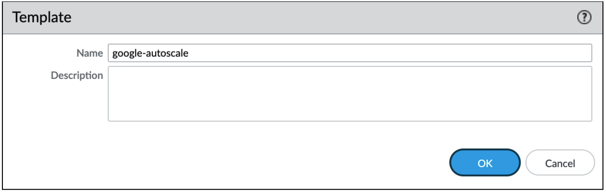

3. Click **Add Stack** to create a template stack.


4. Enter a name for the template stack.  In the **TEMPLATES** window, add the template you created in the previous step.  Click **OK**.


### Configure Template Settings

In this section, we will configure the Panorama template with a baseline configuration to route the spoke network traffic and to pass the internal load balancer health checks. We will also enable the VM-Series to pass its PAN-OS petrics to Google Stackdriver. These metrics can be used to scale the VM-Series horizontally based on custom utilization levels.  We will view the metrics later in the guide.


#### Publish PAN-OS Metrics to Google Stackdriver

1. Click the **Device** tab.  Select the template you created in the previous step from the **Template** dropdown menu.


2. Navigate to **VM-Series → Google**.  Click the gear icon.


3. Check ON **Publish PAN-OS metrics to Stackdriver**.  Set the update interface to `1 minute`.  Click **OK**.

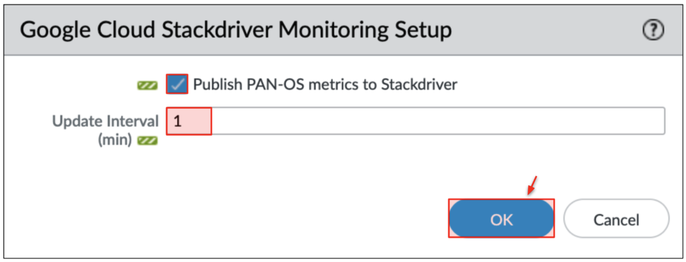


#### Create Security Zones

1. Click the **Network** tab.  Select the template you created in the previous step from the **Template** dropdown menu.


2. Click **Zones → Add**

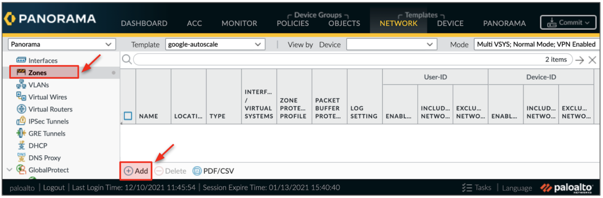

3. Enter `untrust` for the zone name.  Select `Layer3` for the interface type. Click **OK**.


4. Create a second zone.  Enter `trust` for the zone name.  Select `Layer3` for the interface type. Click **OK**.

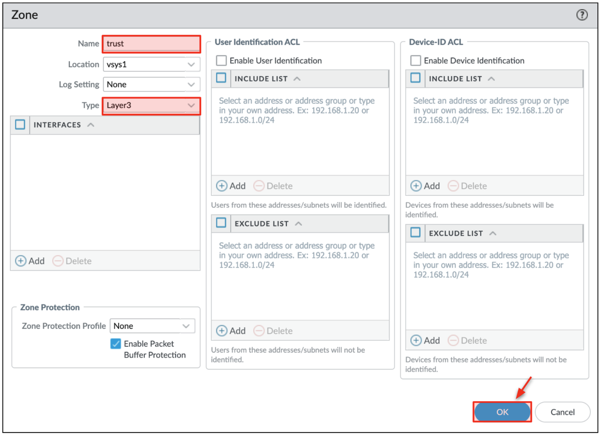


#### Create Virtual Router

1. Click **Virtual Routers** **→ Add**.  Enter `VR1` for the Virtual Router name.  Click **OK**.


#### Create Interfaces

1. Create the untrust dataplane interface (ethernet1/1).  Click **Interfaces → Add Interface**


2. Click the **Config** tab.  Set the untrust interface as follows:
    * **Slot** - `Slot 1`
    * **Interface** **Name** - `ethernet1/1`
    * **Interface** **Type** - `Layer3`
    * **Virtual** **Router** - `VR1`
    * **Security** **Zone** - `untrust`


3. Click the **IPv4** tab.  Select **DHCP Client**.  **_Check ON_** the automatic default route generation box.  Click **OK**.


4. Create a second interface for the trust network.  Click **Add Interface**.

5. Click the **Config** tab.  Set the trust interface as follows:
    * **Slot** - `Slot 1`
    * **Interface** **Name** - `ethernet1/2`
    * **Interface** **Type** - `Layer3`
    * **Virtual** **Router** - `VR1`
    * **Security** **Zone** - `trust`


6. Click the **IPv4** tab.  Select `DHCP Client`.  **_Check OFF_** the automatic default route generation box.  Click **OK**.

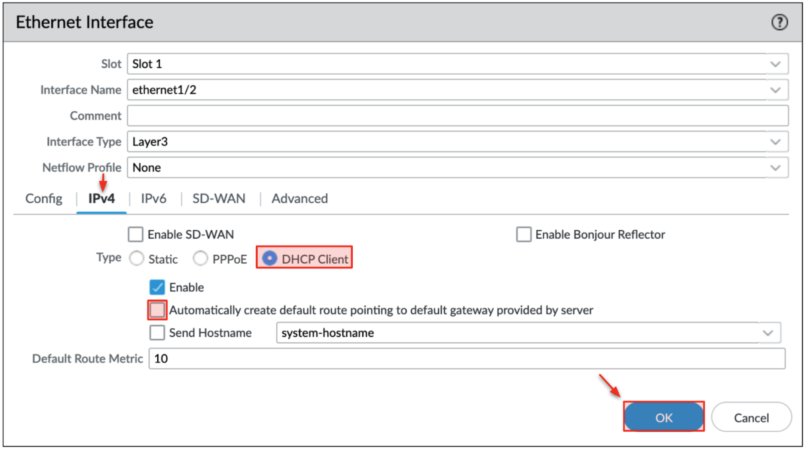

7. We need to create a loopback interface to forward the load balancer’s health probe requests.  Click **Loopback → Add**.


8. In the **Config** tab, set the numeric suffix to `.1` (or to any available suffix) to identify the interface.  Set the Virtual Router to `VR1` and the Security Zone to `trust`.

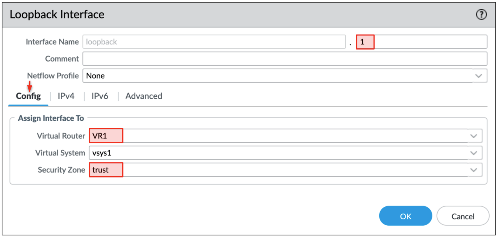

9. In the **IPv4** tab, set a static dummy /32 IP address (i.e. `100.64.0.1/32`).  This address can be any IP address that is not used in the environment. 

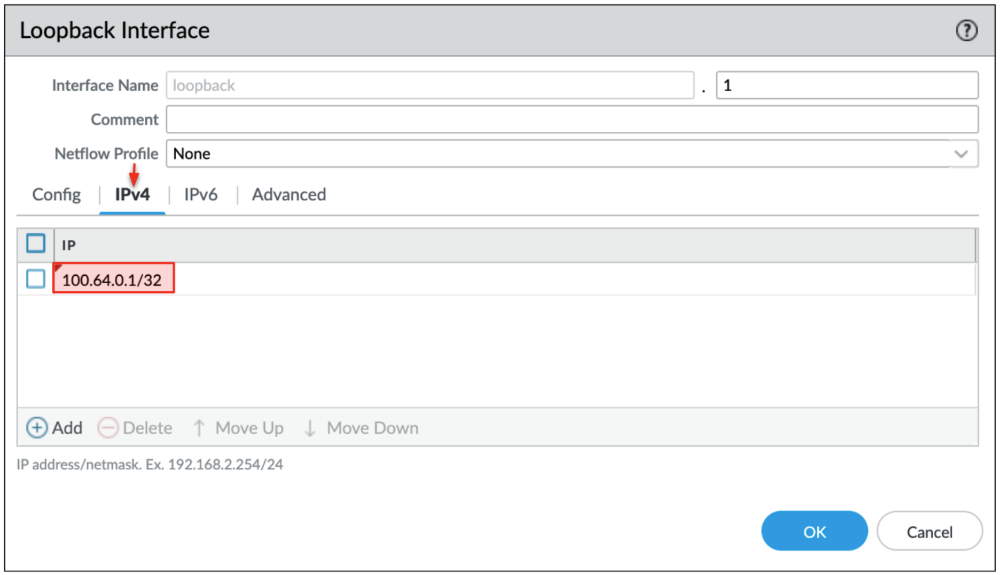

10.  Click the **Advanced** tab.  Select the **Management Profile** dropdown and click **New Management Profile**. 

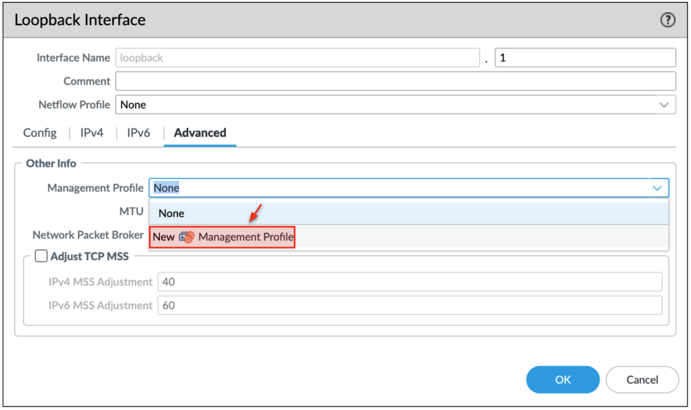

11.  Enter a name for the Management Profile.  **_Check ON_** `HTTP` to allow the internal load balancer’s TCP/80 health probe.  It is recommended to restrict the management profile to Google Cloud’s health probe ranges: `35.191.0.0/16` & `130.211.0.0/22`.  Click **OK**.

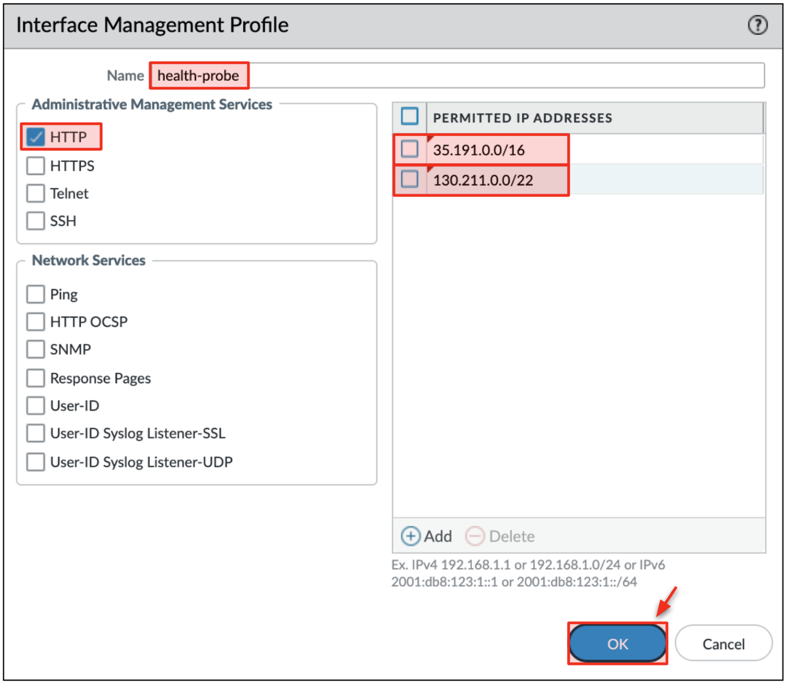

12.  Click **OK** on the Loopback interface creation window. Click **OK** on the security warning prompt.


#### Create Static Routes on Virtual Router

We need to add 3 routes to the virtual router to route north/south and east/west traffic for the spoke VPC networks (`10.0.0.0/8`) and to also route the internal load balancer health probes correctly.  Go to **Virtual Routers → VR1 → Static Routes → Add**.


1.   Configure the first route as follows.  This route directs the internal load balancer’s health probe range `35.191.0.0/16` to the trust subnet’s default gateway `10.0.2.1`.  


2.   Configure the second route as follows.  This route directs the internal load balancer’s health probe range `130.211.0.0/22` to the trust subnet’s default gateway `10.0.2.1`. 


3.  Configure the third route as follows.  This route hairpins east-west traffic between spoke1 VPC `10.1.0.0/16` and spoke2 VPC `10.2.0.0/16` through the VM-Series firewall’s trust interface `ethernet1/2`. 


**<span style="text-decoration:underline;">Your static routes should look like the image below before proceeding.</span>** 


### Create a Panorama Device Group

In this section, we will create a Panorama device group.  The device group contains all of the security policies and objects that are applied to the VM-Series firewalls.  Device groups contain firewalls that you want to manage as a group.  Panorama treats the device group as a single unit when applying policies.  In autoscale deployments, it makes sense for the firewalls to belong to the same device group so they receive the same policy and object configurations. 

Upon deployment, the VM-Series firewalls bootstrap to the device group that is defined in the managed instance group’s metadata configuration. 

1. Click **Panorama →** **Device Groups → Add**.  

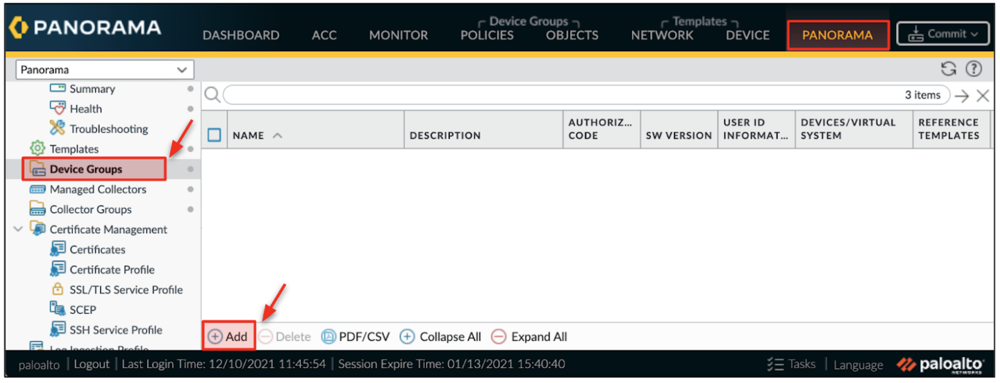

2. Enter a name for the device group.  In the **REFERENCE TEMPLATES** window, add the _template stack_ you created in the previous step.


**<span style="text-decoration:underline;">Record the name of your device group and template stack before proceeding.</span>**


### Configure Device Group 

In this section, we will configure the baseline settings for the Panorama device group.  The device group will be configured with security policies to allow the internal load balancer’s health probes to pass through VM-Series.  We will also configure the default security policies to deny and log traffic.


#### Create Health Probe Security Policy

1. Click the **Policies** tab.  Select the device group you created in the previous step from the **Device Group** dropdown menu.  On the left menu, go to to **Security → Pre Rules → Add**. 


2. Enter a name for the security policy.


3. Click the **Source** tab.  Set the **source zone** to `Any`.  Set the **source address** to `35.191.0.0/16` & `130.211.0.0/22`.


4. Click the **Destination** tab.  Set the **destination zone** to `Any`.   


5. Click the **Actions** tab.  Set **action** to `Allow`.  Set the log settings to `Log at Session End` and select your log forwarding profile (optional). Click **OK**.


#### Create Destination NAT for Health Probes

Here we will create a single destination NAT to translate the Google internal load balancer’s health probe ranges to the loopback interface we previously created.

1. On Panorama, navigate to **Policies → NAT → Pre Rules → Add**. Verify you are modifying the device group you previously created. 

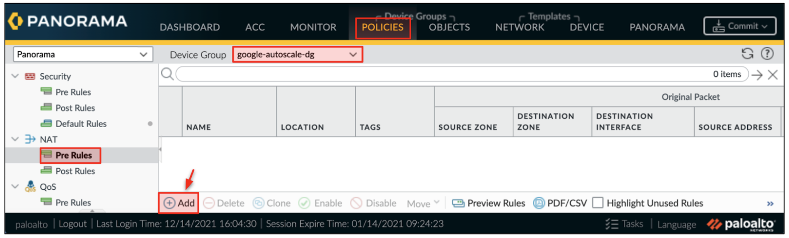

2. Enter a name for the NAT rule.


3. **_Original Packet Tab_**
    * **Source Zone** - `trust`
    * **Destination Zone **-** `trust`**
    * **Destination Interface** - <code>ethernet1/2<strong> </strong></code>(trust interface)
    * <strong>Source Address </strong>- <code>35.191.0.0/16</code> & <code>130.211.0.0/22</code>


4. **_Translated Packet Tab_** 
    * Source Address Translation
        * **Translation Type -** `None` 
    * Destination Address Translation
        * **Translation Type -** `Dynamic IP (with session distribution)` 
        * **Translated Address -** `100.64.0.1` (IP address of the loopback interface)

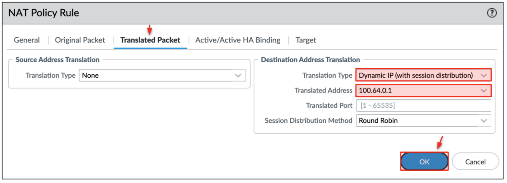


#### Modify Predefined Security Rules 

In this section, we will configure the predefined security polices to deny and log all traffic.  It is important to set the intrazone-default rule to deny because all VPC to VPC traffic traverses through the same zone.

1. Go to **Policies → Security → Default Rules**. 
2. _Highlight_ the intrazone-default security policy.  Click **Override**.


3. Click the **Actions** tab.  Set the Action to `Deny`.  **_Check ON _Log at Session End** and select your log forwarding profile.   Click **OK**.

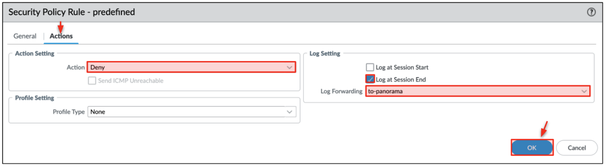

4. Repeat the process for the **interzone-default** rule.  


### Commit the Changes

1. Commit the changes to Panorama.  **Commit → Commit to Panorama → Commit**.

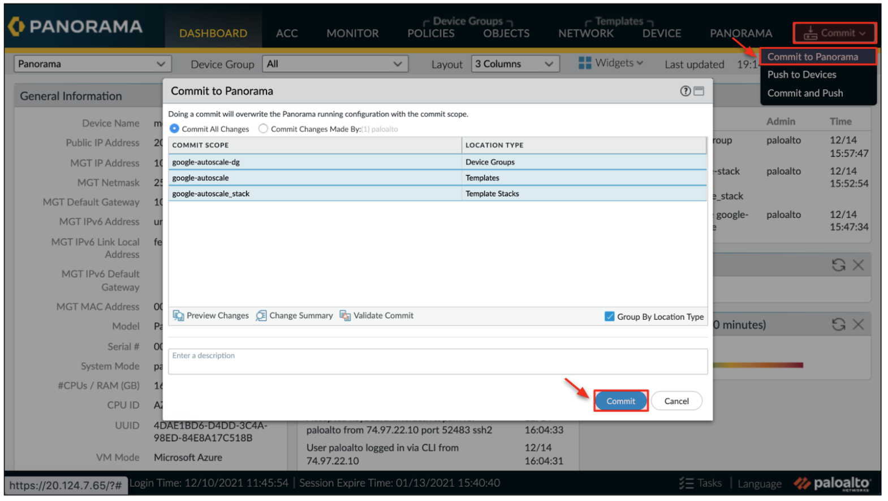


### Create a Panorama VM Auth Key

In this section, we will generate a vm-auth-key on Panorama.  This key will be added to the launch template's metadata.  During a scaling event (or initial deployment), the VM-Series use vm-auth-key to automatically register with the Panorama device group and template stack (which are also defined in the launch template's metadata).  After successful connection, Panorama automatically commits the entire device group and template stack configuration to the firewall.

1. Log into the Terminal console/CLI of your Panorama appliance. 

2. Enter the following command to generate a VM Auth Key.   The key lifetime can vary between 1 hour and 8760 hours (1 year).   

```
request bootstrap vm-auth-key generate lifetime <1-8760>
```

(Output)

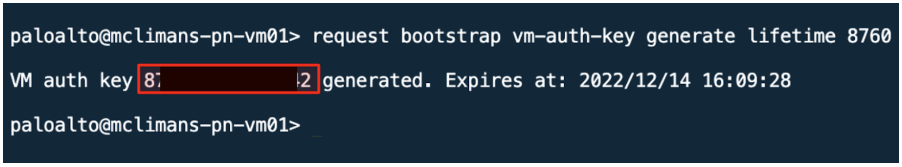

**Record the vm-auth-key value before proceeding to the next step**. 


## Launch the Build

In this section, we will walk through how to deploy the environment using Terraform.   After the Terraform build completes, the virtual machines may take an additional 10 minutes to finish their bootup process.

1. Open Google Cloud Shell by clicking the shell icon in the top right hand corner.


2. In cloud shell, copy and paste the following to enable the required Google Cloud APIs and to create an SSH key.  

```
gcloud services enable compute.googleapis.com
ssh-keygen -f ~/.ssh/gcp-demo -t rsa -C gcp-demo
```

**Note.** If you are using a SSH key name that is different from `gcp-demo` name, you must modify the `public_key_path` variable in your terraform.tfvars file to match the name of the key you created. 

3. Copy and paste the following to clone the repository and to apply the Terraform plan.

```
git clone https://github.com/wwce/google-cloud-vmseries-builds
cd google-cloud-vmseries-builds/architecture-demos/vmseries-hub-spoke-autoscale
```

4. Click **Open Editor** to open the Google Cloud Shell editor.


5. Open the terraform.tfvars file in `google-cloud-vmseries-builds/architecture-demos/vmseries-hub-spoke-autoscale`

6. Edit lines 1-4 to match your Panorama IP, Device Group, Template Stack, and VM Auth Key.  **Note.** The Panorama address must be accessible from the management VPC network (defaults to internet connectivity). 


7. Save the file.  Click **Open Terminal**.

8. Change directories to the build directory.  Initialize and apply the Terraform plan.

```
cd google-cloud-vmseries-builds/architecture-demos/vmseries-hub-spoke-autoscale
terraform init
terraform apply
```

9. Verify that the Terraform plan will create **52** resources. Enter `yes` to start the build.


10.  When the build completes, the following output will be displayed. 


_Optional._  If you want to use the autoscaling feature within the Panorama GCP plugin, please set the <code>panorama_deployment_name</code> value as deployment name within the plugin configuration.</em>

11.  Navigate to **Panorama → Managed Devices → Summary**.  Set the refresh timer to 10 seconds.


**Wait ~10 minutes for the firewalls to successfully bootstrap.**

12.  Proceed to the next section once the VM-Series and are listed as in-sync (green bubble) with the Panorama device group. 


## Configure NAT Policies for Internet Inbound & Outbound Traffic

In this section, we will map the external load balancer frontend addresses and ports to a web server in spoke1 VPC and a jump server in spoke2 VPC.  The mapping is performed by creating a NAT policy on the VM-Series that corresponds with the external load balancer’s frontend IP and port configuration. 


### Create Internet Inbound Destination NAT Policies

First, we will gather the IP addresses and ports used on two of the external load balancer’s forwarding rules.  Then, we will create two corresponding destination NAT policies on Panorama for each forwarding rule.  The first NAT policy will translate the load balancer’s TCP/80 forwarding rule to the web server in the spoke1 VPC network.  The second NAT policy will translate the load balancer’s TCP/22 forwarding rule to the jump server in the spoke2 VPC network. 


#### Gather IP and Port Information

1. On the Google Cloud console, navigate to **Network Services → Load Balancers**.


2. There are two load balancers. 
   * `<prefix>-extlb-vmseries` - This is the VM-Series external load balancer.  It distributes internet inbound traffic to the VM-Series untrust interfaces.
   * `<prefix>-intlb-vmseries` - This is the VM-Series internal load balancer.  It distributes outbound traffic from the spoke networks to the VM-Series trust interfaces (i.e. spoke-to-internet, or spoke-to-spoke traffic).  It is **_healthy_** because we pre-configured the Panorama device group to pass the health checks. 


3. Open the `<prefix>-extlb-vmseries` load balancer. 
   
   There are two frontend IP addresses with unique frontend ports: `TCP/80` and `TCP/22`.  Record each frontend IP address and port.  Each frontend IP address and port will be set as the original destination IP and port in the VM-Series NAT policy. 


4. On the Google Cloud console, navigate to **Compute Engine → VM Instances**.


5. Record the Internal IP address for the VMs in spoke VPC networks: `<prefix>-spoke1-web` and `<prefix>-spoke2-jump`.  Each IP address will be set as the translated address in the VM-Series NAT policy.


#### Create NAT Policy for Spoke1 Web Servers (TCP/80)

1. On Panorama, navigate to **Policies → NAT → Pre Rules → Add**. 


2. Enter a name for the NAT policy.


3. **_Original Packet Tab_**
   * **Source Zone** - `untrust`
    * **Destination Zone** - `untrust`
    * **Destination Interface** - `ethernet1/1`
    * **Service** - Select `Create a new service`.  Give it a name and enter `80` in the destination port field.
    </b>
      
    * **Destination Address** - Enter the external load balancer’s frontend address that is assigned TCP/80.


1. **_Translated Packet Tab_** 
    * Source Address Translation
        * **Translation Type** - `Dynamic IP and Port` 
        * **Address Type** - `Interface Address`
        * **Interface** - `ethernet1/2` (trust interface for synchronous response)
    * Destination Address Translation
        * **Translation Type** - `Dynamic IP (with session distribution)` 
        * **Translated Address** - `10.1.0.10` (IP address of spoke1-web-vm)
        * **Translated Port** - `80` (The port the spoke1-web-vm is listening on)


5. Click **OK** to create the NAT rule.


#### Create NAT Policy for Spoke1 Jump Server (TCP/22)

1. Add another NAT rule, go to **Policies → NAT → Pre Rules → Add**.  This NAT will map the TCP/22 frontend to the jump server in the spoke2 VPC network. 

2. Enter a name for the NAT policy.


3. **_Original Packet Tab_**
    * **Source Zone** - `untrust`
    * **Destination Zone** - `untrust`
    * **Destination Interface** - `ethernet1/1`
    * **Service** - Select `Create a new service`.  Give it a name and enter `22` in the destination port field.
    </b>
    
    * **Destination Address** - Enter the external load balancer’s frontend address that is assigned TCP/22.


4. **_Translated Packet Tab_** 
    * Source Address Translation
        * **Translation Type** - `Dynamic IP and Port` 
        * **Address Type** - `Interface Address`
        * **Interface** - `ethernet1/2` (trust interface for synchronous response)
    * Destination Address Translation
        * **Translation Type** - `Dynamic IP (with session distribution)` 
        * **Translated Address** - `10.2.0.10` (IP address of spoke2-jump-vm)
        * **Translated Port** - `22` (The port the spoke2-jump-vm is listening on)


5. Click **OK**.


### Create Outbound Internet NAT Policy

In order for the spoke VPC networks to reach the internet through the VM-Series, a source NAT policy must be created on the VM-Series firewall to translate the spoke internal addresses to the public IP associated with the VM-Series untrust interfaces (ethernet1/1). 

1. Add another NAT rule, go to **Policies → NAT → Pre Rules → Add**.  Enter a name for the outbound NAT policy. 


2. **_Original Packet Tab_**
    * **Source Zone** - `trust`
    * **Destination Zone** - `untrust`


3. **_Translated Packet Tab_**
    * Source Address Translation 
        * **Translation Type** - `Dynamic IP And Port`
        * **Address Type** - `Interface Address`
        * **Interface** - `ethernet1/1` (untrust interface)
        * **IP Type** - `IP` (leave IP address field set to `None`.  This is because we are using DHCP addresses on the VM-Series interfaces.)
    * Destination Address Translation
        * `None`


1. Click **OK**.

**<span style="text-decoration:underline;">Your NAT policies should look like the image below before proceeding.</span>**  


### Create Security Policies

In this section, we will create generic security policies to allow internet inbound, internet outbound, and east-west (spoke to spoke) traffic through the VM-Series firewalls. 


#### Internet Inbound Security Policy

Here we will create a generic security policy to allow web-browsing and SSH from the internet (through the external LB) to the spoke networks.

1. Go to **Policies → Security → Pre Rules → Add**.


2. Enter a name for the rule. 


3. **_Source Tab_** - Set **source zone** to `untrust`.


4. **_Destination Tab_** - Set **destination zone** to `trust`,  **destination address** to the external load balancer’s frontend IP addresses.


5. **_Application Tab_** - Add `web-browsing` and `ssh`.


6. **_Actions Tab_** - Set **action** to `Allow`.  Check `Log at Session End` and select a log forwarding profile (optional).  Click **OK**.


#### Internet Outbound Generic Security Policy

Here we will create a generic security policy to allow the spoke networks to communicate to the internet through the VM-Series firewalls. 

1. Add another security rule. Go to **Policies → Security → Pre Rules → Add**.

2. Enter a name for the rule. 


3. **_Source Tab_** - Set **source zone** to `trust`.


4. **_Destination Tab_** - Set **destination zone** to `untrust`


5. **_Application Tab_** -Add `apt-get`,  `dns`,  `ping`,  `ssl`, `traceroute`, and  `web-browsing`.


6. **_Actions Tab_** - Set **action** to `Allow`.  Check `Log at Session End` and select a log forwarding profile (optional).  Click **OK**.


#### East-West (VPC to VPC) Generic Security Policy

Lastly, we will create a generic security policy to allow the spoke2 VPC network (10.2.0.0/16) to communicate with the spoke1 VPC network (10.1.0.0/16) using several applications. 

1. Add another security rule. Go to **Policies → Security → Prerules → Add**.


2. Enter a name for the rule. 


3. **_Source Tab_** - Set **source zone** to `trust`.  Set the** source address** to the spoke2 VPC network CIDR range `10.2.0.0/16`.


4. **_Destination Tab_** - Set **destination zone** to `untrust`.  Set the **destination address** to the spoke1 VPC network CIDR range `10.1.0.0/16`.


5. **_Application Tab_** - Add `ping` and `web-browsing`.


6. **_Actions Tab_** - Set **action** to `Allow`.  Check `Log at Session End` and select a log forwarding profile (optional).  Click **OK**.


**<span style="text-decoration:underline;">Your security policies should look like the image below before proceeding.</span>**


### Commit the Changes

1. Commit and Push the changes.  **Commit → Commit and Push**.


2.  Click **Commit And Push** to push the changes to the VM-Series firewalls.


### Test Internet Inbound, Internet Outbound, and East-West Traffic

In this section we will test internet inbound through the external TCP/UDP load balancer, internet outbound from the jump server in spoke2 VPC, and east/west traffic through the internal load balancer to the VM-Series trust interfaces. 

#### Test Internet to Web Server in Spoke1 VPC

1. Copy the frontend address that is mapped to TCP/80.  Paste the address into a web browser.


2. The **SOURCE IP** shows which VM-Series is handling the session.  Try refreshing the web-page several times.  The **SOURCE IP** will eventually change.  This demonstrates the Google Cloud traffic distribution capabilities between the VM-Series firewalls and the external load balancer. 


#### Test Internet to Jump Server in Spoke2 VPC

1. Copy and paste the command below into your Google Cloud shell.  Replace `<your_frontend_address>` with the frontend address that is mapped to TCP/22.

```
ssh paloalto@<your_frontend_address>
```


1. Password to log into the jump server.

```
Pal0Alt0@123
```


#### Test Internet Outbound from Jump Server

1. While logged into the spoke2 jump server, run the following commands to generate outbound traffic.

```
sudo apt update
```


#### Test East-West between Spoke2 and Spoke1 VPC Networks

1.  While still logged into the spoke2 jump server, launch a repeat curl to the web server IP (10.1.0.10) in the spoke1 VPC network. 

```
curl http://10.1.0.10/?[1-5]
```

2. Exit out of the spoke2 jump server.

```
exit
```


#### View Traffic on Panorama (or VM-Series directly)

1. On Panorama, navigate to **Monitor → Traffic**.  Enter the following into the log filter.

```
( app eq apt-get ) or ( app eq web-browsing ) or ( app eq ssh ) 
```


1. With the filter applied, you should see you internet inbound web request and SSH session (from your public IP address), the spoke2 jump server's outbound apt-get request, and the web-browsing traffic between the spoke2 jump server and the spoke1 web server. 


### PAN-OS Stackdriver Metrics

In this section, we will look at the PAN-OS metrics that are sent from the VM-Series firewalls to Google Stackdriver.  We will then show how these metrics can be applied to the VM-Series instance group to scale the firewall’s horizontally. 


#### View PAN-OS Metrics

1. In the Google Cloud console, navigate to **Monitoring →  Metric explorer**.


2. Set **Resource Type** to `VM Instance`

3. In the **Metric** field, search for `custom`.  A list of the PAN-OS metrics will appear.  Select the `panSessionActive` metric. 


4. Set **Group by** to `instance_group`, **Aggregator** to `sum`, and **Minimum alignment period** to `1 minute`.


5. The graph on the right will display the total session count at 1 minute intervals for each zone based instance group. 


#### How to Apply VM-Series Autoscaling Policy

The instance group’s scaling conditions can be adjusted by modifying the instance group’s autoscaling policies.

1.  Navigate to **Compute Engine → Instance Groups**.  Select either `<prefix>-vmseries-igm-<zone>` instance group.


2. Click **Edit**.


  
3. Go to **Autoscaling Policy**.  Click the pencil icon next to the panSessionActive metric (default metric in this build).


4. In the **Metric identifier** field, search for `custom`.  Select a metric you want to scale upon (i.e. `DataPlaneCPUUtilizationPct`).


5. For the metric selected, set the **Utilization target** to the percentage you want to scale the VM-Series firewalls.  In this example, by setting the utilization target to 80, an additional firewall will be deployed when the dataplane utilization hits 80%.  Click **Done**.


6. Scroll down and click **Save**.   


7. Click the **Monitoring** tab to view the metrics for the instance group.  The metrics for dataplane utilization are near 0%.  This is because the VM-Series is handling very little traffic.

**Note.** It may take several minutes for the metrics to appear in the GUI. 


## Destroy Environment

If you would like to destroy the environment, run the following commands  from the `/google-cloud-vmseries-builds/architecture-demos/vmseries-hub-spoke-autoscale` directory in Google Cloud shell.

```
terraform destroy
rm ~/.ssh/gcp-demo
```


## Conclusion

You have completed the build.  You have learned how to build the VM-Series firewalls in a managed instance group and how to horizontally scale the firewalls based on PAN-OS metrics delivered to Google Stackdriver.  You have also learned how to create a baseline configuration for the VM-Series firewalls, including:  NAT policies, security policies, virtual router configuration, interface configuration, and more. 