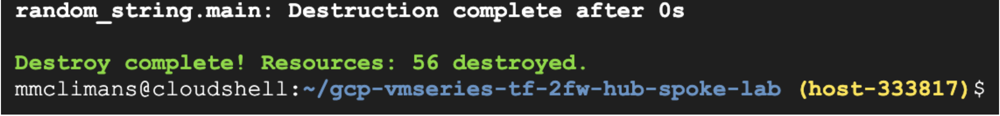

# Secure Hub-and-Spoke Architecture on Google Cloud with a Common Set of VM-Series Firewalls

## Overview
Palo Alto Networks VM-Series ML-NGFW is the industry-leading virtualized security platform to protect applications and data with next-generation security features in Google Cloud.  In this lab, you will use a common set of VM-Series firewalls to secure internet inbound, internet outbound, and east-west traffic for a Google Cloud hub and spoke architecture.  This lab focuses on how various traffic flows traverse through the VM-Series firewall (or hub) to Google spoke networks.  You will also learn how to leverage Google Cloud network load balancers to provide horizontal scale and cross zonal redundancy to your own VM-Series deployments. 


### Lab Objectives 
* Review Google Cloud hub-and-spoke architecture using common VM-Series firewalls.
* Build the lab environment using Terraform by Hashicorp.
* Validate and visualize internet inbound, internet outbound, and east-west (VPC to VPC) traffic flows through Google Cloud load balancers and the VM-Series firewalls.


### Topology
The diagram below shows the lab environment we will be building.  Everything depicted in the diagram is built through Terraform, including the local configuration of any compute resources. All traffic from the Spoke VPC networks traverse through the VM-Series firewalls for inspection. Later in the lab, we will show how each flow is routed and maintained through the firewalls and load balancers. 


The table below provides a brief explanation of each VPC network with its intended function.  In short, the untrust, trust, and management VPC networks are used only by the VM-Series to secure traffic to/from the spoke VPC networks.  All private Google Cloud workloads should be deployed in the spoke VPC networks because all ingress and egress traffic from the spoke networks is inspected by the VM-Series firewall. 


<table>
  <tr>
   <td><strong>VPC Network</strong>
   </td>
   <td><strong>Purpose</strong>
   </td>
  </tr>
  <tr>
   <td>Management
   </td>
   <td>The management VPC is used only to host the VM-Series management interfaces.  The management interfaces are used to access the VM-Series user interface or terminal console.
   </td>
  </tr>
  <tr>
   <td>Untrust
   </td>
   <td>The VM-Series untrust datpalane interfaces (ethernet1/1) reside in the untrust network.  Each of the VM-Series untrust interfaces have an associated public IP address.  The public IP addresses are used to provide outbound internet access for private resources in the trust and spoke VPC networks.  The untrust interface also serves as the backendpool of an Google Cloud external TCP/UDP load balancer.  This load balancer is used to distribute internet inbound requests destined to the spoke networks to the VM-Series untrust interfaces for inspection. 
   </td>
  </tr>
  <tr>
   <td>Trust
   </td>
   <td>The VM-Series trust dataplane interfaces (ethernet1/2) reside in the trust network.  The trust interfaces serve as the internal load balancer’s backend pool.  The trust VPC has a default route pointing to the forwarding rule of the internal TCP/UDP load balancer to steer all egress traffic from the spoke networks through the VM-Series trust interfaces.  This default route is exported over the VPC peering connections to the spoke networks via <a href="https://cloud.google.com/vpc/docs/vpc-peering">Import/Export Custom Routes</a>. In other words, the internal load balancer is the default gateway for all spoke networks that are peered to the trust VPC network. 
   </td>
  </tr>
  <tr>
   <td>Spoke1
   </td>
   <td>Spoke1 contains two web servers frontended by a Google internal TCP/UDP load balancer (10.1.0.10).  Internet inbound traffic to the spoke1 web servers will traverse through the VM-Series external load balancer and then to the VM-Series for inspection.
   </td>
  </tr>
  <tr>
   <td>Spoke2 
   </td>
   <td>Spoke2 contains a single Ubuntu instance.  This instance will be used to test internet outbound traffic and east-west traffic flows (spoke2 to spoke1).  Both of these flows will be routed to the VM-Series internal load balancer as the next hop.  
   </td>
  </tr>
</table>

## Build the Lab Environment
In this section, we will walk through how to deploy the environment using Terraform. Please note, after the Terraform build completes, the virtual machines may take an additional 10 minutes to finish their boot-up process.

1. Open Google Cloud Shell by clicking the shell icon in the top right hand corner.


2. In cloud shell, copy and paste the following to enable the required Google Cloud APIs and to create an SSH key.

```
gcloud services enable compute.googleapis.com
ssh-keygen -f ~/.ssh/gcp-demo -t rsa -C gcp-demo
```
<span style="color:red">**Note.** If you are using a SSH key name that is different from `gcp-demo` name, you must modify the `public_key_path` variable in your terraform.tfvars file to match the name of the key you created.</span>


3. Copy and paste the following to clone the repository and to apply the Terraform plan.
```
git clone https://github.com/wwce/gcp-vmseries-tf-2fw-hub-spoke-lab
cd gcp-vmseries-tf-2fw-hub-spoke-lab
terraform init
terraform apply
```

4. Verify that the Terraform plan will create 56 resources. Enter `yes` to start the build.


5. Once the build completes, the following output will be generated.  


## Verify Build Completion 
1. The virtual machines in this lab can take up to 10 minutes to finish their deployment.  
2. Copy and paste the `VMSERIES01_ACCESS` and `VMSERIES02_ACCESS` output values into separate web browser tabs.


3. Once you receive the Palo Alto Networks VM-Series login page, use the credentials below to log into the firewalls.

```
Username: paloalto
Password: Pal0Alt0@123
```

## Internet Inbound Traffic 
In this section, we will demonstrate internet inbound traffic through the VM-Series firewalls to a web application hosted in the spoke1 VPC network.  The inbound request will be distributed by the external TCP/UDP load balancer to one of the VM-Series firewall’s untrust interfaces.  The VM-Series then inspects the request and applies a destination and source network address translation (NAT) policy to the traffic.  The destination NAT is directed to the internal load balancer’s frontend address (10.1.0.10) of the spoke1 web servers.  The source NAT is applied to dynamically change the client IP address to the IP address of the VM-Series trust interface (192.168.2.0/28).  Source NAT is required on the inbound path to ensure the response from the web-server traverses through the VM-Series that received the initial client request. 

<p align="center"><i>Inbound: Client-to-Server Request Path</i></p>


<p align="center"><i>Inbound: Server-to-Client Response Path</i></p>


1. Copy and paste the `EXT_LB_URL` output value into a web browser.  You will see a page similar to the image below.  This is the web page of the internal web application hosted in the spoke1 VPC network.  The **SOURCE IP** represents the VM-Series that is inspecting the traffic and the **LOCAL IP** represents the web server that received the request. 


2. Try refreshing the web-page several times.  The **SOURCE IP** and **LOCAL IP** values will eventually change.  This demonstrates the Google Cloud traffic distribution capabilities between the VM-Series firewalls and the internal web application in spoke1.


3. On both VM-Series firewalls, navigate to **Monitor → Traffic**


4. Copy and paste the following into the VM-Series log search bar.  This query will narrow the logs so you can find your previous inbound request. 

```
( zone.src eq untrust ) and ( zone.dst eq trust ) and ( app eq web-browsing )
```


<p align="center"><b>Traffic Logs vmseries01</b></p>


<p align="center"><b>Traffic Logs vmseries02</b></p>


## Internet Outbound Traffic

In this section, we will demonstrate internet outbound traffic from the spoke networks through the VM-Series firewalls.  The trust VPC network has a default route that uses the VM-Series internal load balancer’s forwarding rule as its next hop.  This default route is propagated to the spoke network’s VPC route tables via the import/export custom route feature by Google Cloud.   Therefore, spoke egress traffic will be routed to its respective peering connection with the trust VPC network.  The trust network’s VPC route table then steers the traffic to the VM-Series internal load balancer for traffic distribution.  Because the traffic is destined for the internet, the VM-Series will inspect and route the traffic out of its untrust interface and to the internet destination. 

<p align="center"><i>Outbound: Client-to-Server Request Path</i></p>


<p align="center"><i>Outbound: Client-to-Server Response Path</i></p>


1. Copy and paste the `SSH_TO_SPOKE2` output value directly into Cloud Shell.  


2. Login using the password below to open an SSH session with the VM instance in Spoke2 (spoke2-vm1).  

```
Pal0Alt0@123
```

3. Try generating some outbound internet traffic by running the following commands from the spoke2-vm1 interface.

```
sudo apt update
sudo apt install traceroute
traceroute www.paloaltonetworks.com
```

4. On the VM-Series, navigate to **Monitor → Traffic**.  Copy and paste the following into the VM-Series log search bar.  This query will filter for all egress traffic from spoke2-vm1. 

```
( addr.src in 10.2.0.10 ) and ( app neq insufficient-data )
```

5. In this particular example, we can see that vmseries01 received the apt-get request from the internal TCP/UDP load balancer and vmseries02 received the traceroute request.  This demonstrates the load balancing capability between the VM-Series firewall and the Google Cloud internal load balancers.

<p align="center"><b>Traffic Logs vmeries01</b></p>


<p align="center"><b>Traffic Logs vmseries02</b></p>


## East-West Traffic

In this section, we will demonstrate east-west traffic between the spoke networks through the VM-Series firewalls.  The east-west traffic flow is identical to the internet outbound flow as described in the previous section. 

However, unlike internet outbound, we will not route the east-west traffic out of the untrust interface.  Instead, we will route/hairpin the request out of the same trust interface that the request was received on.  Hairpinning east-west traffic provides a scalable and simplified design without sacrificing security capabilities.  It is simple because the trust network is VPC peers with all of the spoke networks, and therefore, the trust network has the necessary routing information to inspect and forward spoke-to-spoke traffic. 

The response traffic from the destination spoke will be routed back to the internal load balancer.  Because the load balancer is leveraging symmetric hashing, the response will be forwarded to the same VM-Series firewall that received the initial request.  Symmetric hashing enables us to scale VM-Series firewalls for east-west flows without apply source translation to maintain flow symmetry.

<p align="center"><i>East-West: Client-to-Server Request Path</i></p>


<p align="center"><i>East-West: Client-to-Server Response Path</i></p>


1. While logged into the spoke2-vm1, launch a repeat curl command to the web server’s internal TCP/UDP load balancer in the spoke1 VPC network. 

```
curl http://10.1.0.10/?[1-1000]
```


2. On both VM-Series, navigate to **Monitor → Traffic**.  Enter the following filter into the log filtering field.  This query will display all traffic from between spoke2-vm1 and our internal load balancer in spoke1. 

```
( addr.src in 10.2.0.10 ) and  ( addr.dst in 10.1.0.10 )
```


3. The traffic is not source translated for east-west traffic.  This is because the Google internal TCP/UDP load balancer uses symmetric hashing to maintain flow persistence for east-west traffic flows.  

<p align="center"><b>Traffic Logs vmseries01</b></p>


<p align="center"><b>Traffic Logs vmseries02</b></p>


## Congratulations

You have completed the lab!  You have demonstrated how to visualize internet inbound,  internet outbound, and east-west traffic flows for a Google Cloud hub-and-spoke architecture through a common set of VM-Series firewalls.  

## (Optional) Destroy Environment

If you would like to destroy the environment, from the directory `vmseries-hub-spoke-vpc-peering` in Google Cloud shell, enter the following commands into Google Cloud Shell from the directory.

```
terraform destroy -auto-approve
rm ~/.ssh/gcp-demo
```


