# Using Network Tags with VM-Series ML-NGFW in Google Cloud

## Overview

Palo Alto Networks VM-Series ML-NGFW is the industry-leading virtualized security platform to protect applications and data with next-generation security features in Google Cloud.  This lab provides guidance on the usage of Google Cloud network tags to steer traffic to specific internal TCP/UDP load balancers that frontend regionally placed VM-Series firewall pairs.  Network tags have a variety of applications, but this lab specifically focuses on leveraging network tags to isolate regional traffic flows for a single global VPC network. 

First, it is important to have a general understanding of how Google Cloud routes traffic to internal load balancers without applying network tags.  VPC networks, including their associated routes and firewall rules, are global resources.  They are not associated with a particular region or zone.  The VPC network’s subnets determine regionality.  This provides organizations with the unique ability to have cloud resources deployed globally, while maintaining a small VPC network footprint with a centralized route domain and firewall rule set. 

The VM-Series firewall with Google Cloud’s internal load balancer can handle egress requests from regions that are different from its own.  For example, if the VM-Series and internal load balancer are deployed in region1, requests from subnets in region2 and region3 can be routed to the region1 firewalls.  However, this may be undesirable due to cross region transaction costs, latency considerations, and cross-region resiliency requirements.   

You could deploy load balanced VM-Series firewalls in regions that are reflective of your workload’s locations.  However, this design previously presented a design issue.  If two or more custom static routes with the same destination using different internal TCP/UDP load balancers as the next hop, the traffic could not be distributed among the load balancers using ECMP.  

This limitation can be completely overcome by leveraging Google Cloud’s network tags.  Network tags make routes applicable only to instances that use the corresponding network tag.  Network tags can be used in a variety of use-cases, including: 

* Prevention of cross-region traffic flows.
* Isolation of egress traffic between development and production environments.
* Creation of “swimming-lanes” to distribute traffic to different sets of load balanced firewalls.

### Lab Objectives

This demonstrates the benefit of using Google Cloud network tags to route traffic to specific internal load balancers that frontend regionally distributed VM-Series firewalls. 

* Secure outbound internet traffic for a global VPC network with two pairs of regionally distributed VM-Series firewalls.  
* Use Google Cloud’s internal TCP/UDP load balancers to distribute traffic to each pair of VM-Series firewalls.  
* Leverage Google Cloud network tags to prevent cross region traffic flows by routing traffic to workload’s corresponding set of VM-Series firewalls. 
* Modify network tags on an internal Google compute resource to change which firewall pair handles the instance’s outbound traffic. 

### Topology

The diagram below describes the lab environment.  Everything depicted in the diagram is built through Terraform, including the local configuration of any compute resources.   


There are 3 VPC networks (management, untrust, and trust) with subnets that span across two regions in Google Cloud (us-east4 and us-west2).  Two network tags (<strong><code><span style="color:cornflowerblue">us-east4-fw</span></code></strong> and <strong><code><span style="color:gold">us-west2-fw</span></code></strong>) are applied to the custom default routes in the trust VPC network.  The network tags are also applied to the private VM instances in each region (<strong>US-EAST4-VM</strong> and <strong>US-WEST2-VM</strong>).  The network tags make the custom routes applicable only to the instances that use the same corresponding network tag.  The table below describes the purpose of each VPC network in more detail. 


<table>
  <tr>
   <td><strong>VPC Network</strong>
   </td>
   <td><strong>Description</strong>
   </td>
  </tr>
  <tr>
   <td>Management
   </td>
   <td>The management VPC is used only to host the VM-Series management interfaces.  The management interfaces are used to access the VM-Series user interface and terminal console.
   </td>
  </tr>
  <tr>
   <td>Untrust
   </td>
   <td>The untrust VPC network contains a dataplane interface from each VM-Series firewall (ethernet1/1).  Each untrust interface has an associated external IP address to provide outbound internet access for the internal compute resources deployed in the trust network. 
   </td>
  </tr>
  <tr>
   <td>Trust
   </td>
   <td>The trust VPC network contains a dataplane interface from each VM-Series firewall (ethernet1/2).  The dataplane interfaces serve as the backendpool of a Google Cloud internal TCP/UDP load balancer.  
<p>
The trust network’s VPC route table has two default routes that use the forwarding rule of either internal load balancer as the next hop.   Each route has a separate network tag applied (<strong><code><span style="color:cornflowerblue">us-east4-fw</span></code></strong> and <strong><code><span style="color:gold">us-west2-fw</span></code></strong>).  The same network tags are applied to the internal compute resources in the trust VPC network to route their outbound traffic to their corresponding regional set of firewalls.   
In other words, outbound requests from <strong>US-EAST4-VM</strong> are routed to the us-east4 internal load balancer and outbound requests from <strong>US-WEST2-VM</strong> are routed to the us-west2 internal load balancer. 
   </td>
  </tr>
</table>


## Build the Lab Environment

In this section, we will walk through how to deploy the environment using Terraform. Please note, after the Terraform build completes the virtual machines may take an additional 10 minutes to finish their boot-up process.

<span style="color:red">**Important!**</span> This build only creates 1 VM-Series firewall in each region.  This does not change the outcome of this lab.  We recommend using Panorama (which is not covered in this lab) to centrally manage load balanced VM-Series firewalls.  If you would like to deploy additional firewalls, uncomment lines `41-59` and `72-75` in the `vmseries_region0.tf` and `vmseries_region1.tf` files before proceeding.

1. Click the shell icon in the top right hand corner to open Google Cloud Shell. 

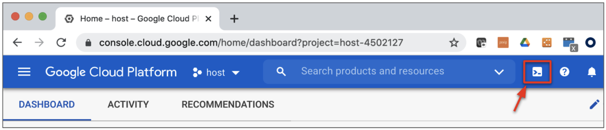

2. In cloud shell, copy and paste the following to enable the required APIs and to create an SSH key.

```
gcloud services enable compute.googleapis.com
ssh-keygen -f ~/.ssh/gcp-demo -t rsa -C gcp-demo
```


<p><span style="color:red"><b>Note.</b> If you are using a SSH key name that is different from `gcp-demo` name, you must modify the `public_key_path` variable in your terraform.tfvars file to match the name of the key you created.</span></p>


3. Copy and paste the following to clone the repository and to apply the Terraform plan.

```
git clone https://github.com/wwce/google-cloud-vmseries-labs
cd google-cloud-vmseries-labs/vmseries-global-vpc
terraform init
terraform apply
```


4. Verify that the Terraform plan will create **54** resources. Enter `yes` to start the build.

<p align="center">
    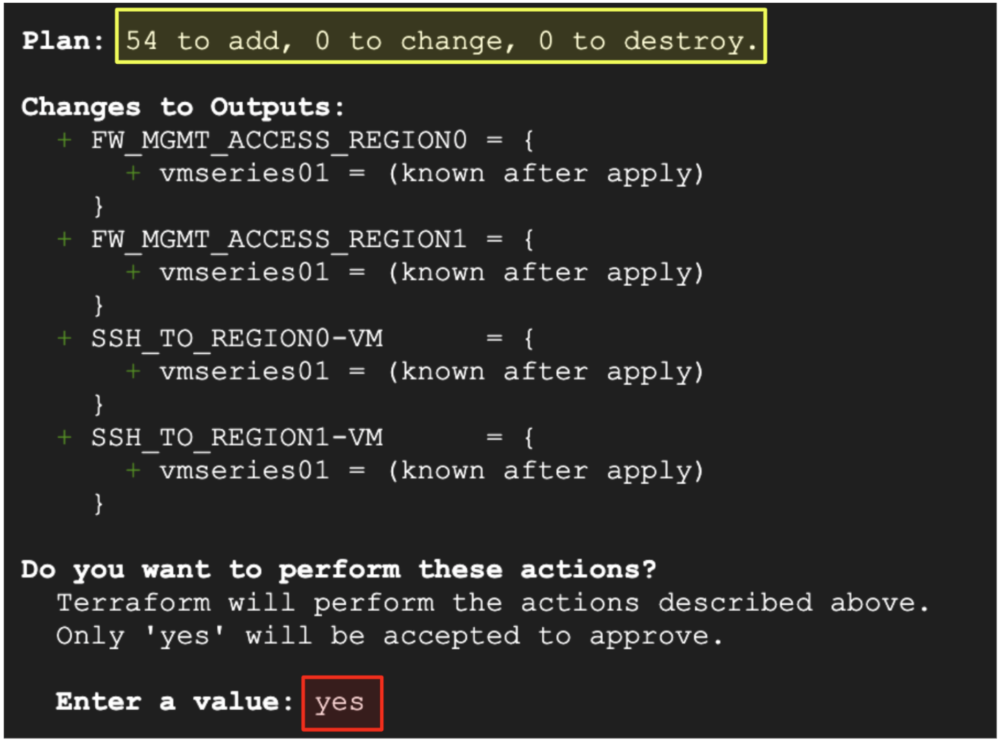
</p>


1. Once the build completes, the following output is generated.  

<p align="center">
    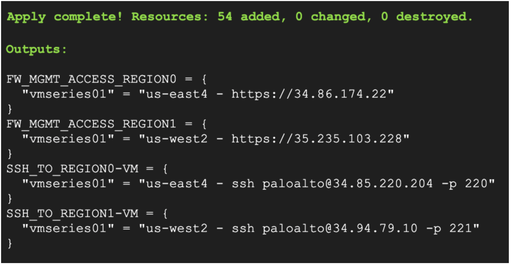
</p>

A description of the output values is summarized in the table below.

<table>
  <tr>
   <td><strong>Output Key</strong>
   </td>
   <td><strong>Output Value</strong>
   </td>
  </tr>
  <tr>
   <td><code>FW_MGMT_ACCESS_REGION0</code>
   </td>
   <td>Displays the management address for the US-EAST4 VM-Series firewalls.
   </td>
  </tr>
  <tr>
   <td><code>FW_MGMT_ACCESS_REGION1</code>
   </td>
   <td>Displays the management address for the US-WEST2 VM-Series firewalls.
   </td>
  </tr>
  <tr>
   <td><code>SSH_TO_REGION0-VM</code>
   </td>
   <td>Command opens a SSH session to the <strong>US-EAST4-VM</strong> instance on TCP/220. 
   </td>
  </tr>
  <tr>
   <td><code>SSH_TO_REGION1-VM</code>
   </td>
   <td>Command opens a SSH session to the <strong>US-WEST2-VM</strong> instance on TCP/221.
   </td>
  </tr>
</table>


## Review Network Tag Configuration

In this section, we will review the trust VPC network’s effective route table.  We will then examine the network tags applied to the VPC's custom routes and compute resources.

1. In the Google console, navigate to **VPC Network → VPC Networks**.

<p align="center">
    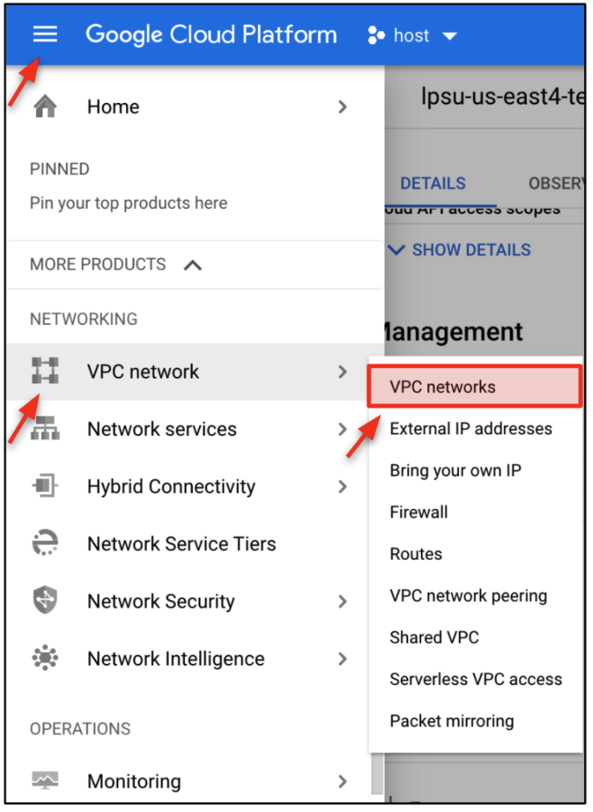
</p>

2. Open the Trust VPC network (`xxxx-trust-vpc`).  

<p align="center">
    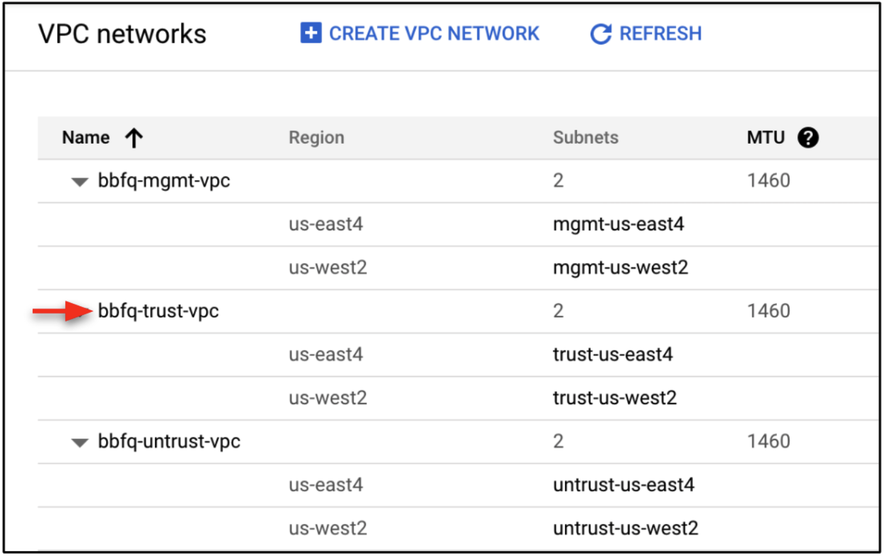
</p>

3. Click **ROUTES**.  

We can see the Trust VPC network has two default that use different internal load balancers as their next hop.  The internal load balancers are in separate regions and frontend the VM-Series firewall's trust dataplane interfaces.  We can also see each route has an applied etwork tag: <strong><code><span style="color:cornflowerblue">us-east4-fw</span></code></strong> & <strong><code><span style="color:gold">us-west2-fw</span></code></strong>.  

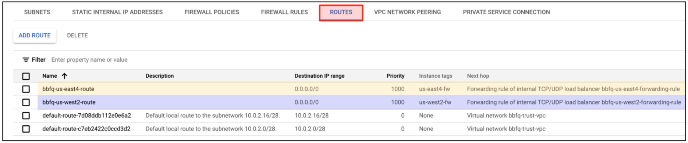

4. Click the `xxxx-us-east4-route` name to open the route details.  

Within the `xxxx-us-east4-route` details, we can see the **US-EAST4-VM** (10.0.2.10) has the <strong><code><span style="color:cornflowerblue">us-east4-fw</span></code></strong> network tag applied.  Therefore, any outbound traffic from this VM will traverse through the us-east4 internal load balancer and VM-Series firewalls. 


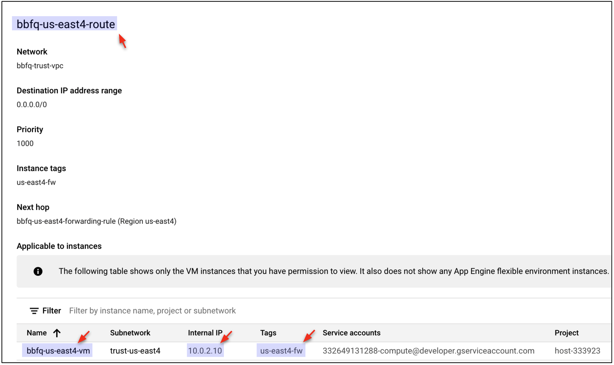

5. Click the `xxxx-us-west2-route` name to open the route details.

Within the `xxxx-us-west2-route` route details, we can see the **US-WEST2-VM** (10.0.2.28) has <strong><code><span style="color:gold">us-west2-fw</span></code></strong> the  network tag applied.  Therefore, any outbound traffic from this VM will traverse through the us-west2 load balancer and VM-Series firewalls. 

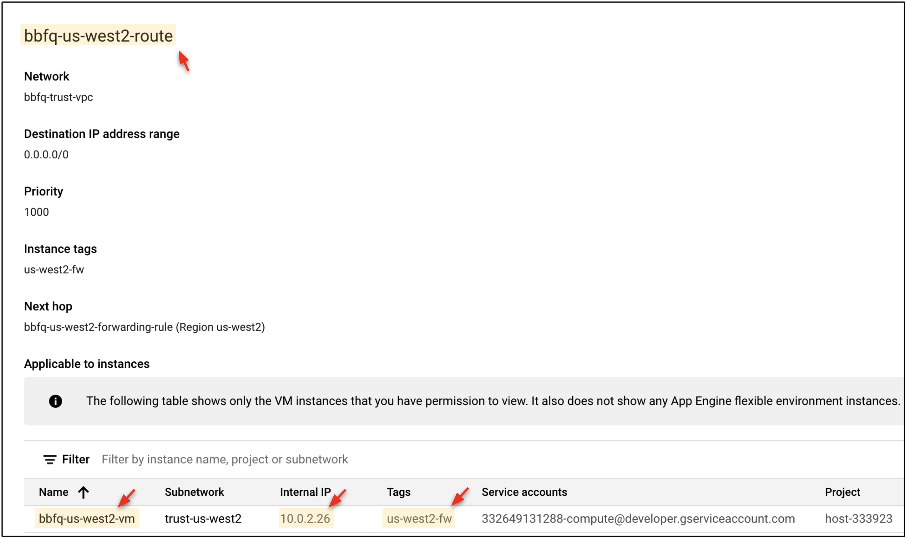


## Log into the VM-Series Firewalls

In this section, we will access the VM-Series management interfaces.  Please note, the virtual machines in this lab take an additional 5-10 minutes to finish their deployment.

1. Copy and paste the output values for `FW_MGMT_ACCESS_REGION0` and  `FW_MGMT_ACCESS_REGION1` into separate web-browser tabs. 

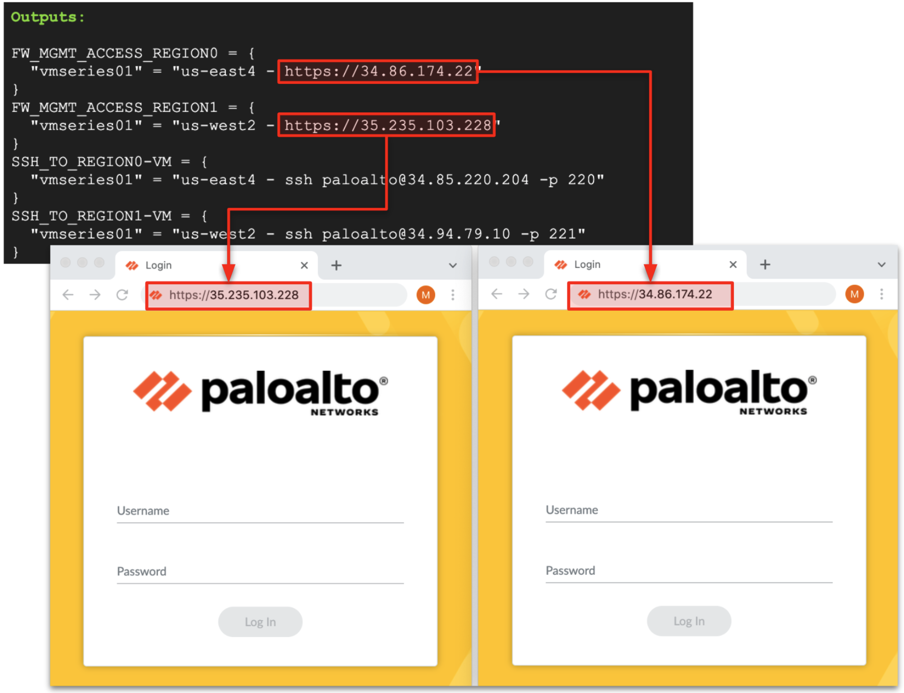

2. Use the credentials below to log into the firewalls.

```
Username: paloalto
Password: Pal0Alt0@123
```


## Test & Visualize Outbound Traffic

In this section, we will open an SSH session to the private virtual machines in each region.  The SSH sessions are established through the public IP address on the VM-Series untrust interfaces. 

The diagram below describes how the VM-Series is translating the inbound SSH connections.  TCP/220 is translated to the **US-EAST4-VM** instance and TCP/221 is translated to the **US-WEST2-VM** instance. 

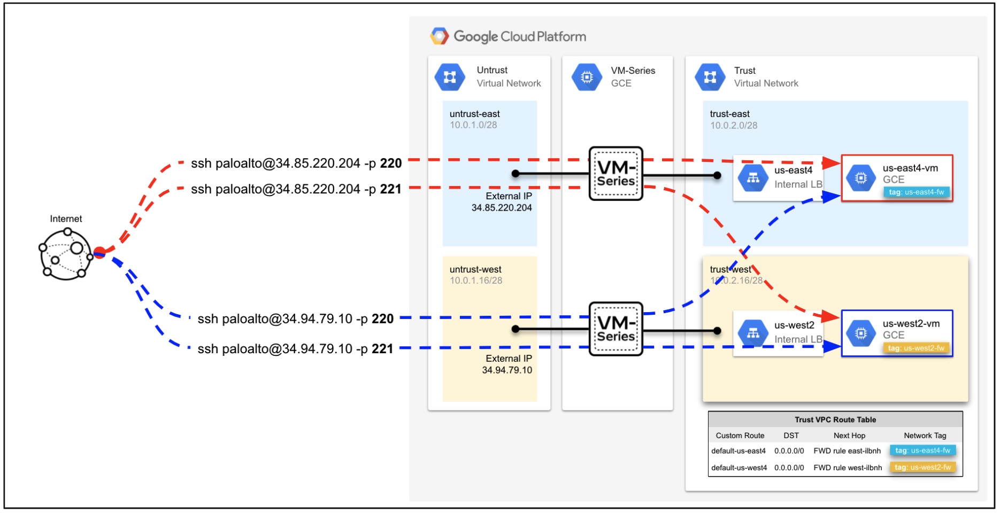


 <p align="center"><span style="color:green"><b>Tip.</b> You can redisplay your Terraform outputs at anytime by running terraform output from the <code>google-cloud-vmseries-labs/vmseries-global-vpc</code> directory. </span></p>

1. Copy and paste the `SSH_TO_REGION0-VM` output value into your cloud shell terminal.  This will open an SSH session to the **US-EAST4-VM** instance. 

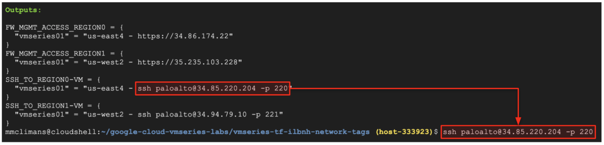

2. Enter the following password to log into the **US-EAST4-VM** instance. 

```
Password: Pal0Alt0@123
```

3. Generate outbound traffic by installing the following packages. 

```
sudo apt update
sudo apt install traceroute
traceroute www.paloaltonetworks.com
```

4. Type `exit`  to close the SSH session to the **US-EAST4-VM** instance.

```
exit
```

5. Open an SSH session to the **US-WEST2-VM** instance by copying the `SSH_TO_REGION1-VM` output value into the cloud shell terminal. 

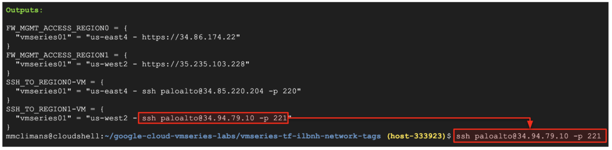


5. Enter the password to log into the **US-WEST2-VM** instance. 

```
Password: Pal0Alt0@123
```


6. Generate outbound traffic by installing the following packages. 

```
sudo apt update
sudo apt install traceroute
traceroute www.paloaltonetworks.com
```


7. Type `exit`  to close the SSH session to the **US-WEST2-VM** instance.

```
exit
```

## View Traffic Logs on VM-Series

In this section, we will view the traffic logs on VM-Series firewalls in both regions.  We should see the outbound traffic from **US-EAST4-VM** flows only though the us-east4 VM-Series.  Likewise, we should see **US-WEST2-VM** traffic flowing only through the us-west2 VM-Series firewalls.

1. On both VM-Series firewalls, navigate to **Monitor → Traffic**. 

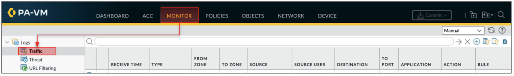

2. Copy and paste the following into the log filter.  This filter displays the logs for all traffic originating from the trust VPC network (10.0.2.0/24). 

```
( addr.src in 10.0.2.0/24 ) and ( app neq insufficient-data )
```

3. We can see the us-east4 VM-Series is only receiving traffic from the **US-EAST4-VM** (10.0.2.10) and the us-west2 VM-Series is only receiving traffic from **US-WEST2-VM** (10.0.2.28).  

 <p align="center"><span style="color:green"><b>Tip</b>. You can quickly determine the firewall’s region by looking at the firewall name in the web-browser tab.</span></p>

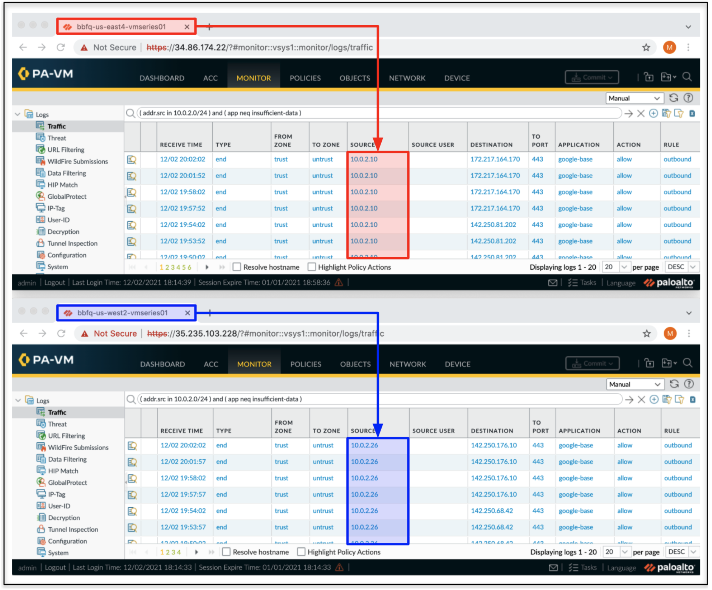


## Modify the Network Tags 

In this section, we will modify the network tags on the **US-EAST4-VM** to use the default route to the us-west internal load balancer and VM-Series firewalls. 


1. On the Google Console, navigate to **Compute Engine → VM Instances**. 

<p align="center">
    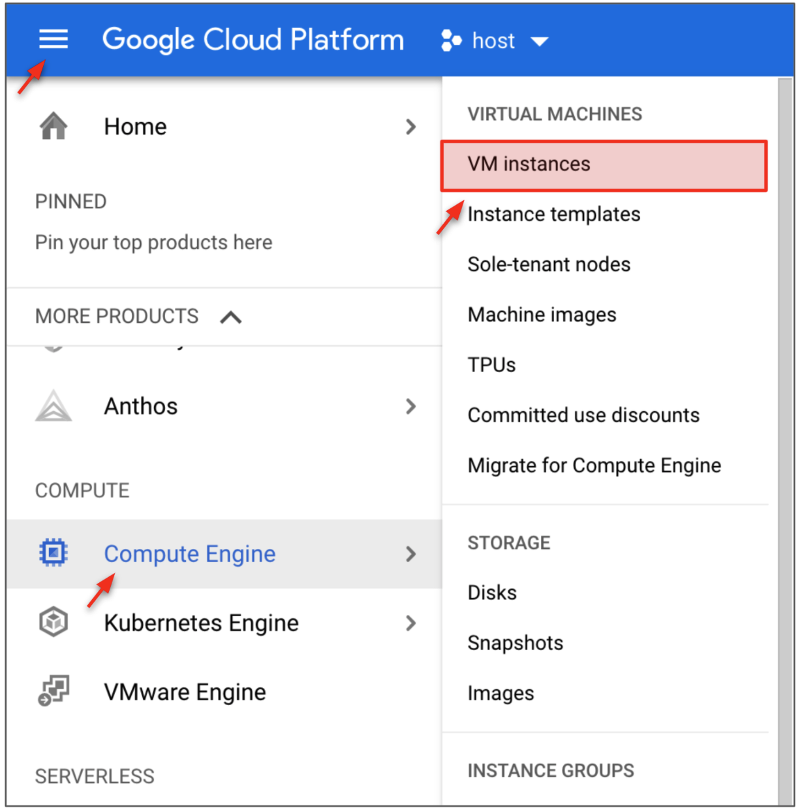
</p>

2. Open the `xxxx-us-east4-vm` instance.  Click **Edit**.

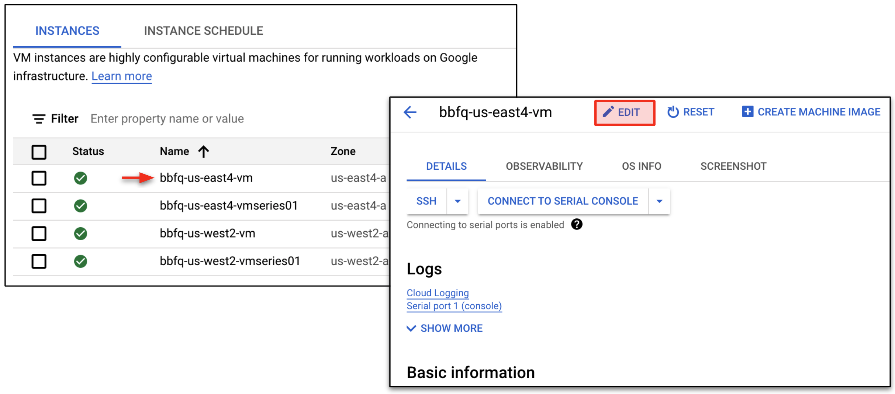

3. Scroll down to **Network tags**.  We can see that the VM has the <strong><code><span style="color:cornflowerblue">us-east4-fw</span></code></strong> network tag applied. This tag matches the tag applied on the default route to the us-east4 internal load balancer.  This means the us-east4 VM instance will only use the us-east4 firewalls for its outbound traffic requests. 

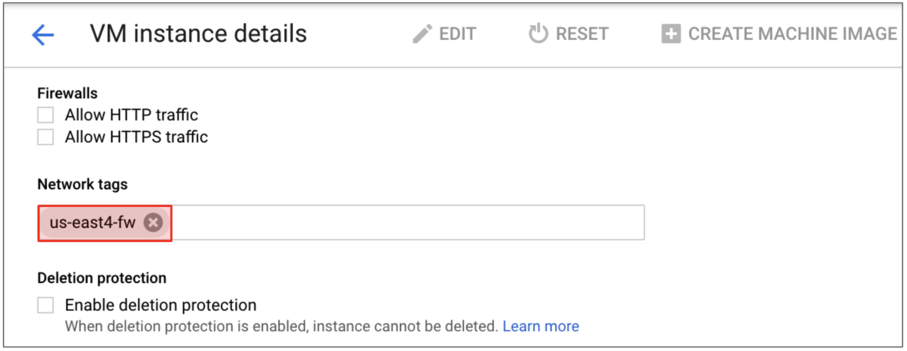

4. Replace the <strong><code><span style="color:cornflowerblue">us-east4-fw</span></code></strong> tag with <strong><code><span style="color:gold">us-west2-fw</span></code></strong> tag.  This will force the default route to the us-west2 internal load balancer to be applied to this VM instance.

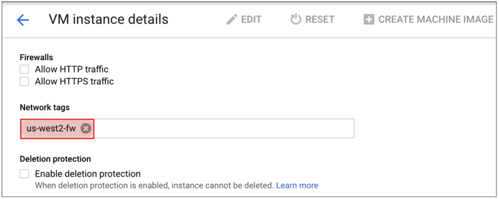

5. Scroll to the bottom and click **Save**.

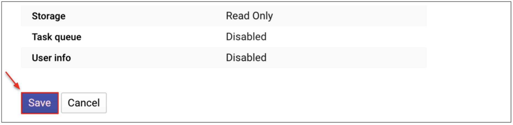

6. Log back into the **US-EAST4-VM** by copying the output `SSH_TO_REGION0-VM `value into cloud shell (password: Pal0Alt0@123). 

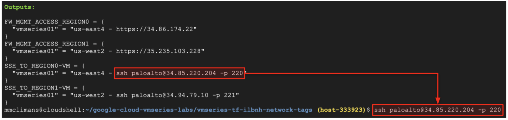

7. Start a ping to 8.8.8.8.

```
ping 8.8.8.8
```
8. On **_<span style="text-decoration:underline;">us-west2</span>_** VM-Series, navigate to **Monitor → Traffic**.  Verify the log filter below is still applied.

```
( addr.src in 10.0.2.0/24 ) and ( app neq insufficient-data )
```

9. You should see **US-EAST4-VM** (10.0.2.10) is now flowing through the VM-Series in us-west2.

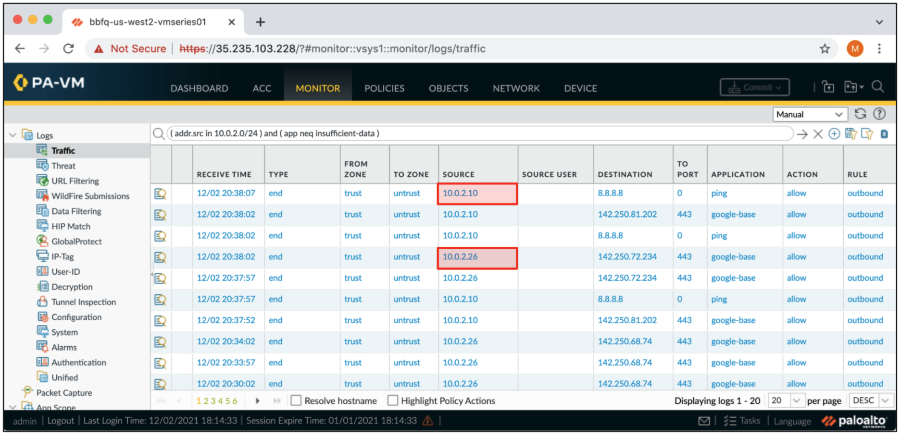

## Congratulations
This concludes the self-paced lab, **Palo Alto Networks: VM-Series Network Tags and TCP/UDP Internal Load Balancing**. You have now successfully leveraged Google Cloud Network Tags to route traffic to specific internal TCP/UDP load balancers that frontend separate VM-Series firewalls.

## (Optional) estroy Environment
If you would like to destroy the environment, from the directory `vmseries-global-vpc` in Google Cloud shell, enter the following commands into Google Cloud Shell from the directory.

```
terraform destroy -auto-approve
rm ~/.ssh/gcp-demo
```

<p align="center">
    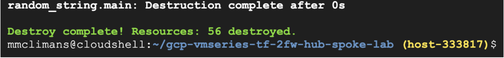
</p>