# VM-Series Blueprint: Global Hub-and-Spoke with VPC Peering

## Overview

In this build, VM-Series firewalls are deployed to secure north/south and east/west traffic for a hub-and-spoke network that spans multiple regions. The spoke networks connect to the hub network via VPC Network Peering and network tags are used to route traffic within a region.

Historically, the spoke networks in this type of topology receive routes from the hub network via VPC Network Peering's import/export custom routes functionality.  It provides simplicity as the entire route domain is maintained by the hub network, but it may lack flexibility for environments that require network tags or separate route domains for their spoke networks.
    
The routing in this build is different because it does not rely on imported/exported custom routes.  Instead, a new route capability is used which allows you to specify a private IP address in an adjacent network as the next-hop.  This allows us to maintain separate route domains for each spoke network and take advantage of network tags to steer traffic to specific VM-Series firewalls.


## Objectives

* Secure north-south and east-west traffic for VPC peered networks that span multiple regions (us-east1 & us-west1).
* Use network tags to route traffic from a given region to the same regional set of VM-Series firewalls.  For example:
  * Route spoke traffic originating from us-east1 to the internal load balancer and VM-Series firewalls in us-east1.
  * Route spoke traffic originating from us-west1 to the internal load balancer and VM-Series firewalls in us-west1.  
* Modify network tags on an internal Google compute resources to change which firewall pair handles the outbound traffic. 

## Topology

The diagram below shows the network topology of the build.  Everything depicted in the diagram is built through Terraform, including the local configuration of the compute resources.   

<p align="center">
    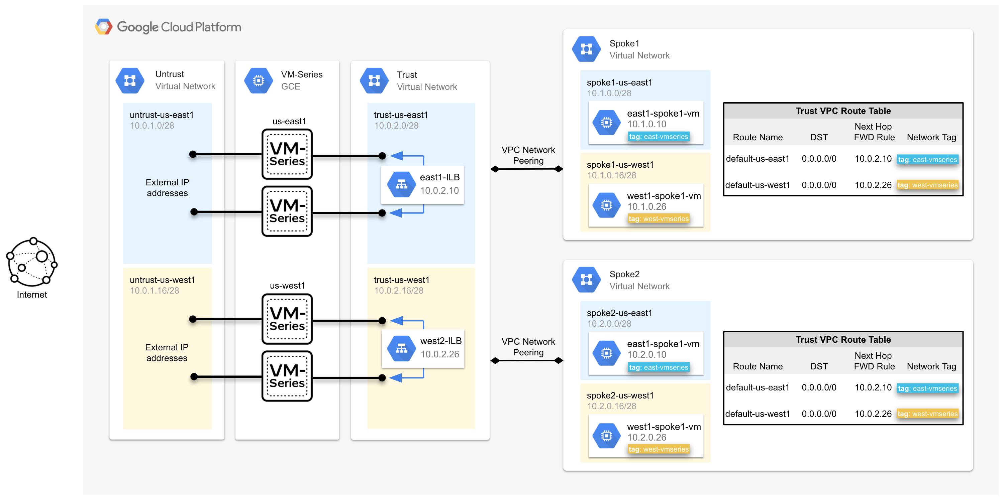
</p>
 

Two network tags (<b>us-east1-fw</b> and <b>us-west1-fw</b>) are applied to custom static routes and to the VMs in each spoke network.  The network tags make the custom routes applicable only to the instances that use the same network tag. 


## Build

In this section, we will deploy the environment with Terraform. 

**Note.** This build only creates one VM-Series firewall in each region.  This is because it is recommended to use Panorama, which is not covered in this lab, to centrally manage load balanced VM-Series firewalls.

1. Open Google cloud shell.

<p align="center">
    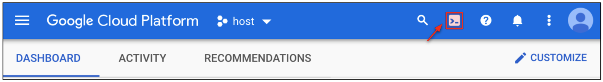
</p>

2. In cloud shell, enable the required APIs and create an SSH key.

```
gcloud services enable compute.googleapis.com
ssh-keygen -f ~/.ssh/gcp-demo -t rsa -C gcp-demo
```

**Note.** If you are using a SSH key name that is different from the `gcp-demo` name, you must modify the `public_key_path` value in your terraform.tfvars file to match the name of the key you created.

3. Clone the repository and apply the Terraform plan.

```
git clone https://github.com/wwce/google-cloud-vmseries-builds
cd google-cloud-vmseries-builds/blueprints/vmseries-hub-spoke-global-vpc
terraform init
terraform apply
```

4. Verify that the Terraform plan will create **73** resources. Enter `yes` to start the build.

<p align="center">
    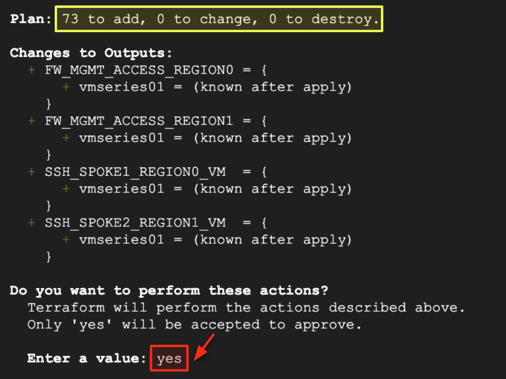
</p>


5. Once the build completes, the following output is generated.  

<p align="center">
    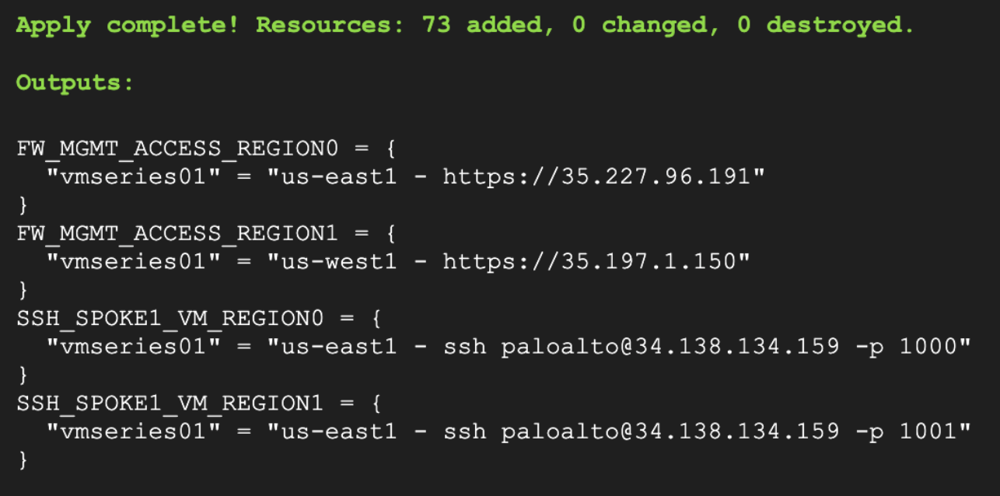
</p>

A description of the output values is summarized below.

<table>
  <tr>
   <td><strong>Output Key</strong>
   </td>
   <td><strong>Output Value</strong>
   </td>
  </tr>
  <tr>
   <td><code>FW_MGMT_ACCESS_REGION0</code>
   </td>
   <td>Management address for the <b>us-east1</b> VM-Series firewall.
   </td>
  </tr>
  <tr>
   <td><code>FW_MGMT_ACCESS_REGION1</code>
   </td>
   <td>Management address for the <b>us-west1</b> VM-Series firewall.
   </td>
  </tr>
  <tr>
   <td><code>SSH_TO_SPOKE1_REGION0_VM</code>
   </td>
   <td>Create a SSH session through the VM-Series to the Ubuntu VM in spoke1 in <b>us-east1</b>. 
   </td>
  </tr>
  <tr>
   <td><code>SSH_TO_SPOKE2_REGION1_VM</code>
   </td>
   <td>Create a SSH session through the VM-Series to the Ubuntu VM in spoke2 in <b>us-west1</b>. 
   </td>
  </tr>
</table>


## Review Network Tag Configuration

First, we will review the network tags applied to the routes and instances in the spoke VPC networks. 

1. In the Google Cloud console, navigate to **VPC Network → VPC Networks → Routes**.

<p align="center">
    
</p>

2. Type `load balancer` into filter box to display routes that use IP address of the internal TCP/UDP load balancer as the next hop.

<p align="center">
    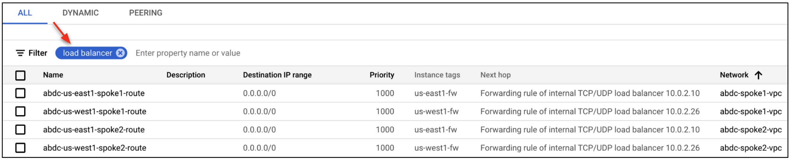
</p>

Each spoke network has two static default routes.  The first uses the IP address of the us-east1 internal TCP/UDP load balancer as the next hop with `us-east1-fw` tag applied.  The second uses the IP address of the us-west1 internal TCP/UDP load balancer address as the next hop with the `us-west1-fw` tag applied.


3. Navigate to **Compute Engine → VM Instances**.

<p align="center">
    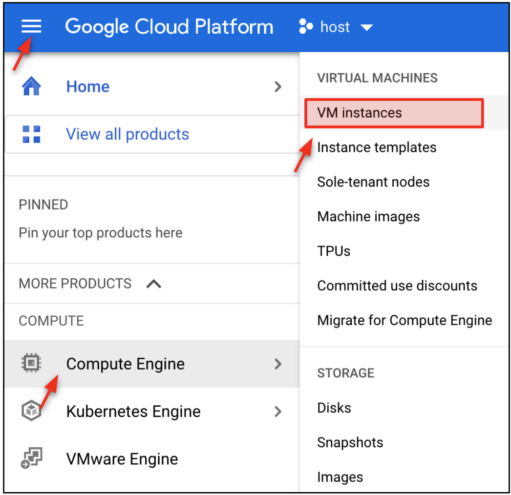
</p>

4. Click the column display box. Check on **Network tags**.

<p align="center">
    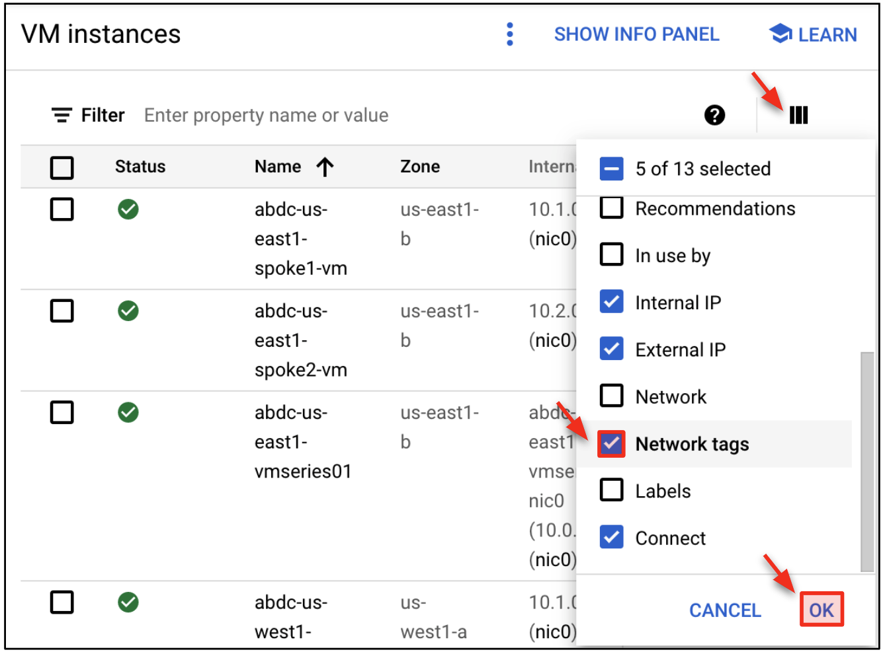
</p>

5. Notice the `us-east1-fw` tag is applied to VMs in the us-east1 region and the `us-west1-fw` tag is applied to VMs in the us-west1 region. 

<p align="center">
    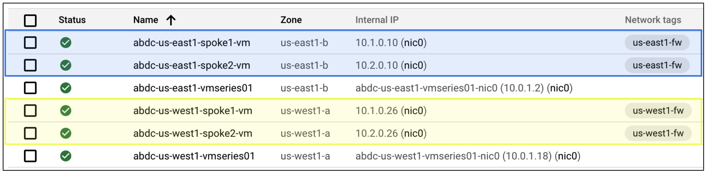
</p>

Network tags make the static routes applicable only to the instances that use the same network tag.  Therefore, any outbound traffic from the us-east1 instances will use the default route to the internal load balancer that frontends the us-east1 VM-Series.  Likewise, any outbound traffic from the us-west1 instances will use the default route to the internal load balancer that frontends the us-west1 VM-Series. 

## Log into the VM-Series Firewalls

Please note, after the build completes, the virtual machines take an additional 10 minutes to finish their boot-up process. 

1. Copy and paste the output values for `FW_MGMT_ACCESS_REGION0` and  `FW_MGMT_ACCESS_REGION1` into separate web-browser tabs. 

<p align="center">
    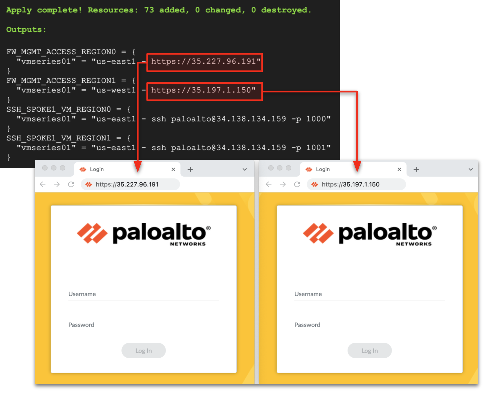
</p>

```
Username: paloalto
Password: Pal0Alt0@123
```


## Test & Visualize Spoke Network Traffic

In this section, we will open SSH connections to VMs in us-east1 and us-west1 within the spoke1 VPC network.  The SSH sessions are established through the public IP addresses on the VM-Series untrust interfaces. 

**Tip.** You can redisplay your Terraform outputs at anytime by running `terraform output` from the build directory.

1. Copy and paste the `SSH_SPOKE1_REGION0_VM` output value into cloud shell.  This will open an SSH session to the us-east1 VM within the spoke1 VPC network.

<p align="center">
    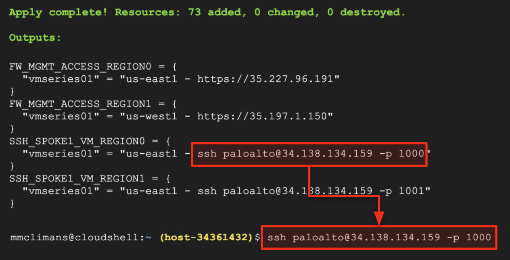
</p>

```
Password: Pal0Alt0@123
```

2. Generate outbound internet traffic and east-west traffic to the us-east1 VM in spoke2.

<p align="center">
    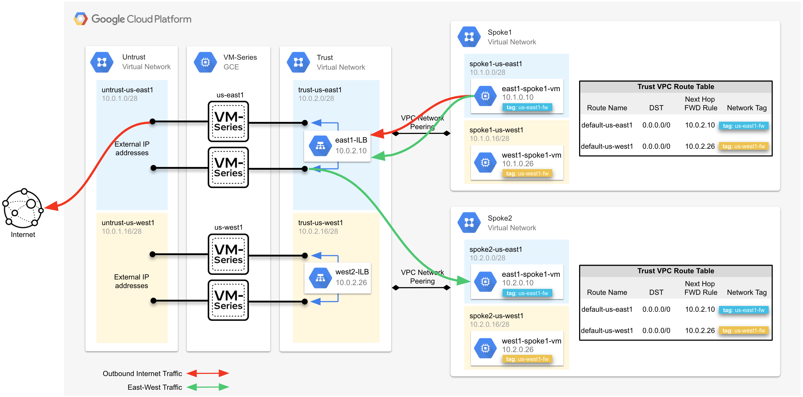
</p>

```
sudo apt update -y
sudo apt install traceroute -y
curl http://10.2.0.10/?[1-10]
```

3. Close the SSH connection.

```
exit
```

4.  Copy and paste the `SSH_SPOKE1_REGION1_VM` output value into cloud shell.  This will open an SSH session to the us-west1 VM within the spoke1 VPC network.

<p align="center">
    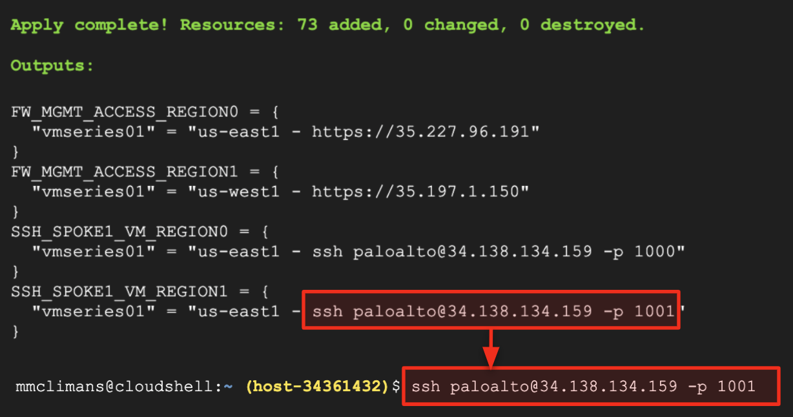
</p>
 
```
Password: Pal0Alt0@123
```


5. Generate outbound internet traffic and east-west traffic to the us-west1 VM in spoke2.

<p align="center">
    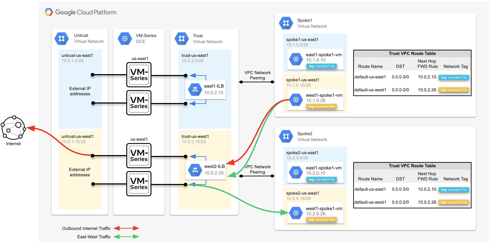
</p>

```
sudo apt update -y
sudo apt install traceroute -y
curl http://10.2.0.26/?[1-10]
```

6. Close the SSH session.

```
exit
```

## View Traffic Logs on VM-Series

View the traffic logs on VM-Series firewalls in both regions.  We should see egress traffic from resources in us-east1 flow only through the us-east1 VM-Series.  Likewise, we should see egress traffic from resources in us-west1 flow only through the us-west1 VM-Series.

1. On both VM-Series firewalls, navigate to **Monitor → Traffic**. 

<p align="center">
    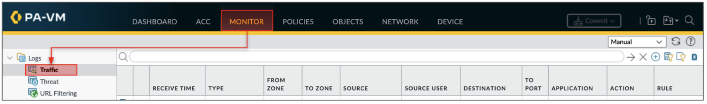
</p>

2. On both firewalls, enter the following into the log filter to search for traffic originating from the spoke1 and spoke2 VPC networks (10.1.0.0/16 and 10.2.0.0/16). 

```
( addr.src in 10.1.0.0/14 ) and ( app eq web-browsing ) or ( app eq apt-get )
```

3. On the us-east1 VM-Series we should only see traffic from resources in us-east1 (us-east1 VM's last octet ends in .10).  On the us-west1 VM-Series, we should only see traffic from resources in us-west2 (us-west2 VM's last octet ends in .26).

**Tip.** You can quickly determine the firewall’s region by looking at the firewall name in the web-browser tab.

<p align="center">
    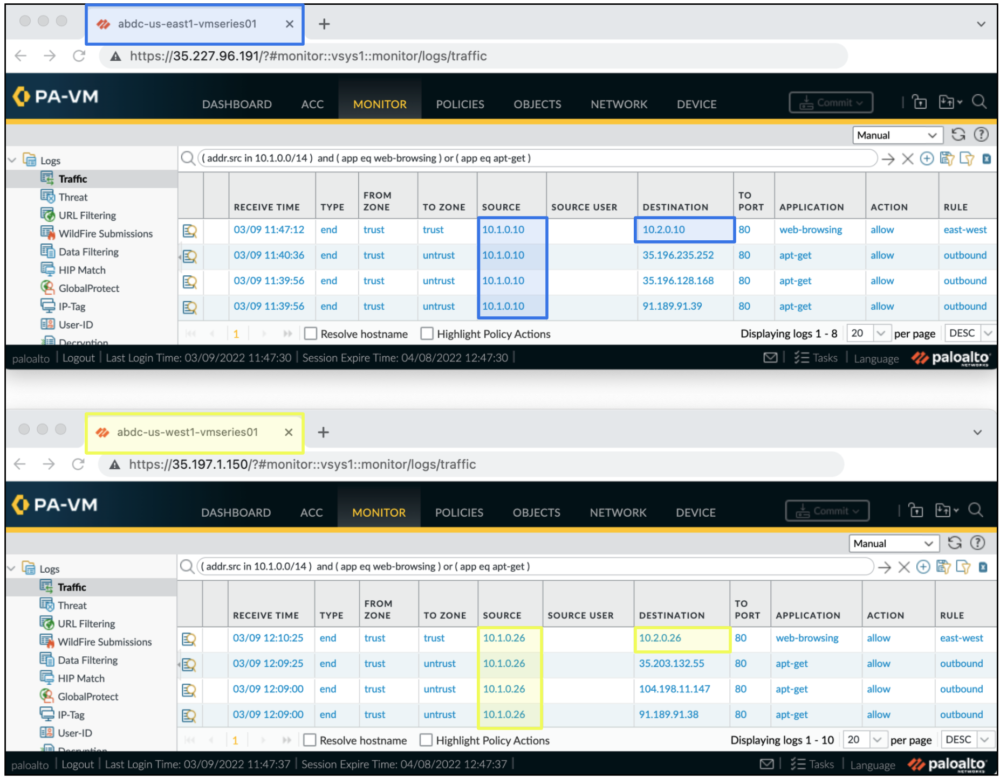
</p>


## Modify the Network Tags 

Finally, we will modify the network tags on the us-east1 VM to use the the us-west1 VM-Series firewalls as the next hop.  

<p align="center">
    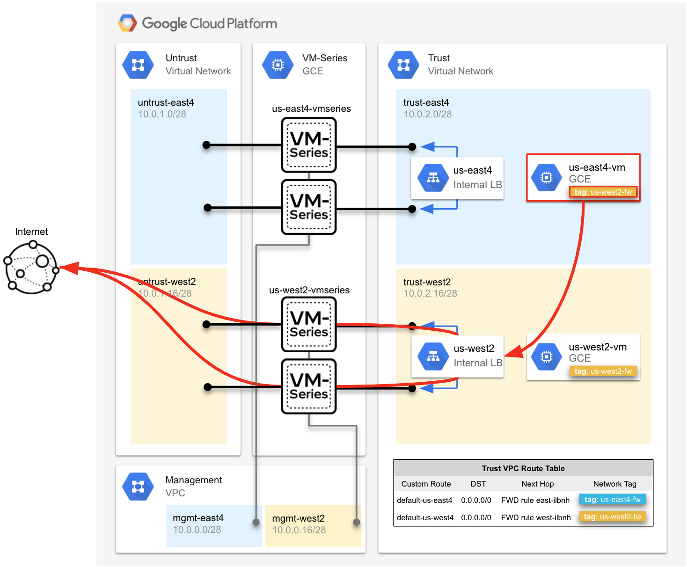
</p>


1. On the Google Console, navigate to **Compute Engine → VM Instances**. 

<p align="center">
    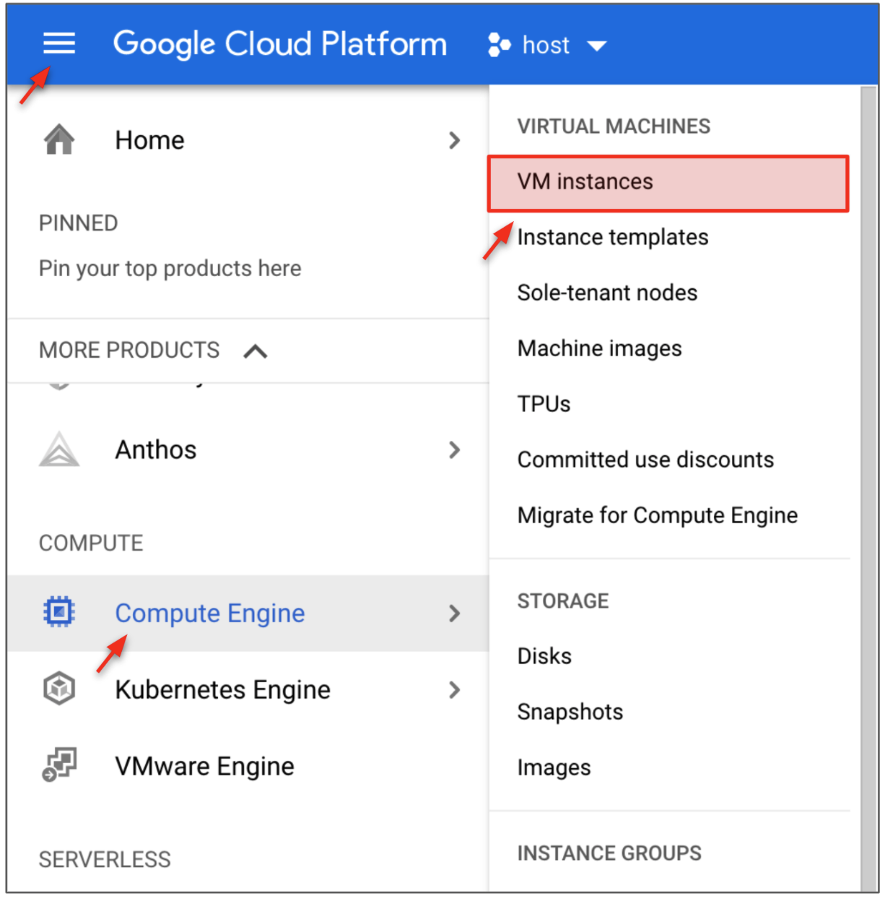
</p>

2. Open the `xxxx-us-east1-spoke1-vm` instance.  Click **Edit**.

<p align="center">
    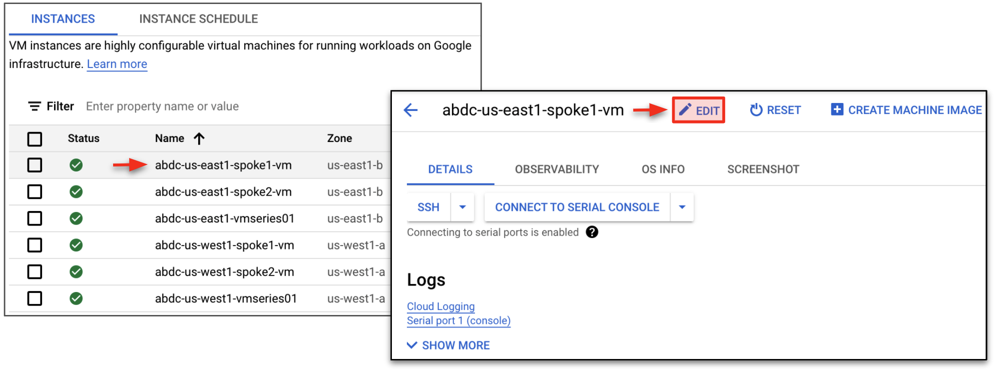
</p>

3. Scroll down to **Network tags**.  Delete the `us-east1-fw` tag.  Enter `us-west1-fw` as the new tag.

<p align="center">
    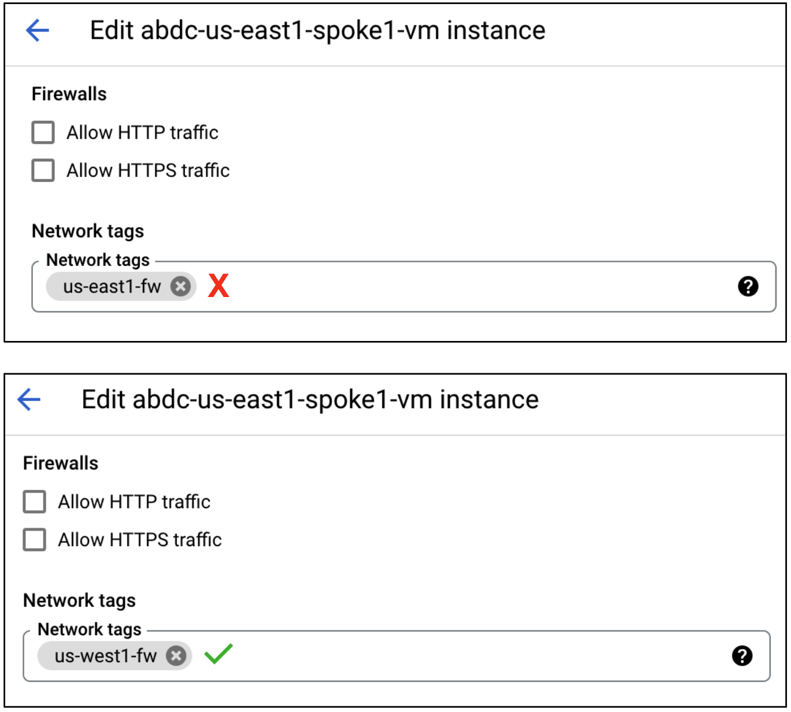
</p>


4. Click **Save**.

<p align="center">
    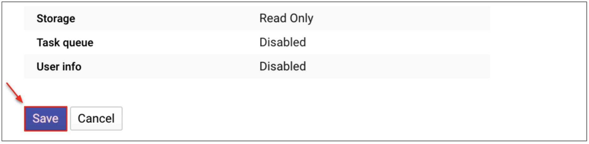
</p>

5. Log back into the spoke1 VM in us-east1. Enter the `SSH_SPOKE1_VM_REGION0` output value into cloud shell. 

<p align="center">
    
</p>
```
Password: Pal0Alt0@123
```
6. Generate outbound internet traffic.

```
ping 8.8.8.8 -c 5
```

7.  Generate east-west traffic to the us-west1 VM in spoke2 VPC.  

```
curl http://10.2.0.26/?[1-10]
```

8. On the us-west1 VM-Series, navigate to **Monitor → Traffic**.  Filter for all traffic sourced from the us-east1 VM in spoke1.

```
( addr.src in 10.1.0.10 )
```

9. You should see the spoke1 VM in us-east1 (10.0.2.10) is now flowing through the VM-Series in us-west2.

<p align="center">
    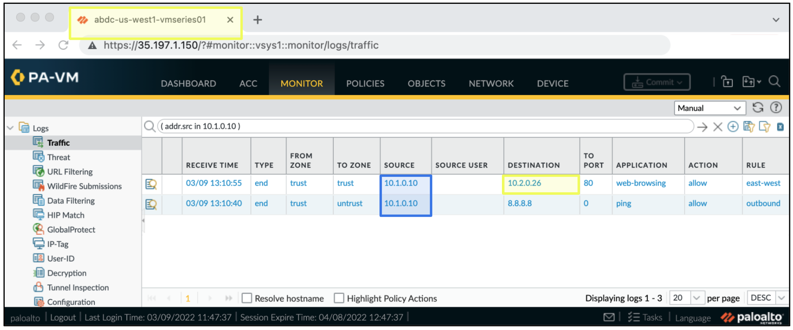
</p>


## Destroy Environment

If you would like to destroy the environment, enter the following in Google cloud shell.

```
cd google-cloud-vmseries-builds
rm ~/.ssh/gcp-demo
terraform destroy -auto-approve
```

## Conclusion

You have completed the guide.  You have learned how to leverage network tags to route traffic to specific internal TCP/UDP load balancers over VPC network peering connections.