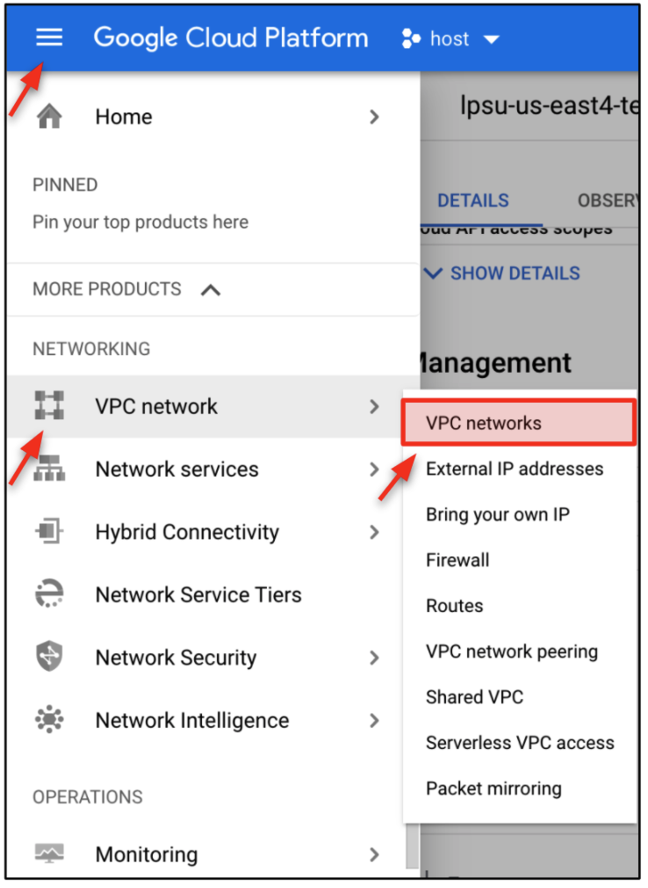
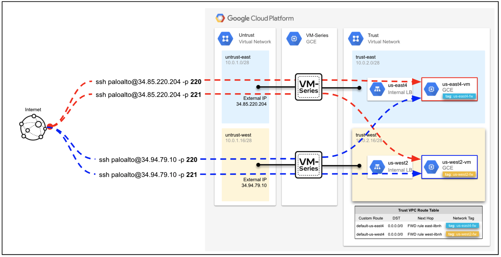
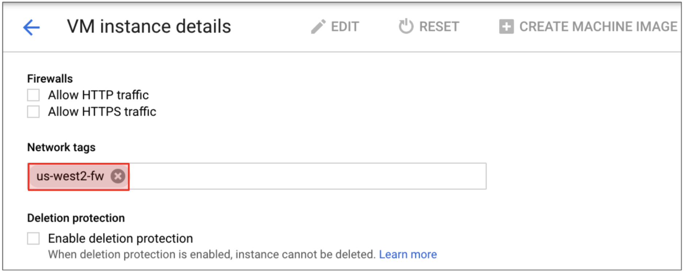

# VM-Series Blueprint: Global VPC with Network Tags

## Overview

In this build, VM-Series firewalls are deployed to secure north/south and east/west traffic for a hub-and-spoke network that spans multiple regions. The spoke networks connect to the hub network via VPC Network Peering and network tags are used to route traffic within a region.

Historically, the spoke networks in this type of topology receive routes from the hub network via VPC Network Peering's import/export custom routes functionality.  It provides simplicity as the entire route domain is maintained by the hub network, but it may lack flexibility for environments that require network tags or separate route domains for their spoke networks.
    
The routing in this build is different because it does not rely on imported/exported custom routes.  Instead, a new route capability is used whcih allows you to specify a private IP address in an adjacent network as the next-hop.  This allows us to maintain separate route domains for each spoke network and take advantage of network tags to steer traffic to specific VM-Series firewalls.


## Objectives

* Secure north-south and east-west traffic for VPC peered networks that span multiple regions (us-east1 & us-west1).
* Use network tags to route traffic from a given region to the same regional set of VM-Series firewalls.  For example:
  * Route spoke traffic originating from us-east1 to the internal load balancer and VM-Series firewalls in us-east1.
  * Route spoke traffic originating from us-west1 to the internal load balancer and VM-Series firewalls in us-west1.  
* Modify network tags on an internal Google compute resource to change which firewall pair handles the outbound traffic. 

## Topology

The diagram below shows the topology of the build.  Everything depicted in the diagram is built through Terraform, including the local configuration of the compute resources.   

<p align="center">
    
</p>
 

Two network tags (<strong><code><span style="color:cornflowerblue">us-east1-fw</span></code></strong> and <strong><code><span style="color:gold">us-west1-fw</span></code></strong>) are applied to custom static routes and Ubuntu instances in each spoke VPC network.  The network tags make the custom routes applicable only to the instances that use the same network tag. 


## Build

In this section, we will deploy the lab with Terraform. Please note, after the build completes, the virtual machines will take an additional 10 minutes to finish their boot-up process. 

<span style="color:red">**Important!**</span> This build only creates 1 VM-Series firewall in each region.  We recommend using Panorama (which is not covered in this build) to centrally manage load balanced VM-Series firewalls.

1. Open Google cloud shell.

<p align="center">
    
</p>

1. In cloud shell, enable the required APIs and create an SSH key.

```
gcloud services enable compute.googleapis.com
ssh-keygen -f ~/.ssh/gcp-demo -t rsa -C gcp-demo
```

**Note.** If you are using a SSH key name that is different from the `gcp-demo` name, you must modify the `public_key_path` value in your terraform.tfvars file to match the name of the key you created.

2. Clone the repository and to apply the Terraform plan.

```
git clone https://github.com/wwce/google-cloud-vmseries-builds
cd google-cloud-vmseries-builds/blueprints/vmseries-hub-spoke-global-vpc
terraform init
terraform apply
```

3. Verify that the Terraform plan will create **54** resources. Enter `yes` to start the build.

<p align="center">
    
</p>


1. Once the build completes, the following output is generated.  

<p align="center">
    
</p>

A description of the output values is summarized in the table below.

<table>
  <tr>
   <td><strong>Output Key</strong>
   </td>
   <td><strong>Output Value</strong>
   </td>
  </tr>
  <tr>
   <td><code>FW_MGMT_ACCESS_REGION0</code>
   </td>
   <td>Displays the management address for the US-EAST4 VM-Series firewalls.
   </td>
  </tr>
  <tr>
   <td><code>FW_MGMT_ACCESS_REGION1</code>
   </td>
   <td>Displays the management address for the US-WEST2 VM-Series firewalls.
   </td>
  </tr>
  <tr>
   <td><code>SSH_TO_REGION0-VM</code>
   </td>
   <td>Command to open an SSH session through the VM-Series to the <strong>US-EAST4-VM</strong> instance on TCP/220. 
   </td>
  </tr>
  <tr>
   <td><code>SSH_TO_REGION1-VM</code>
   </td>
   <td>Command opens a SSH session through the VM-Series to the <strong>US-WEST2-VM</strong> instance on TCP/221.
   </td>
  </tr>
</table>


## Review Network Tag Configuration

In this section, we will review the trust VPC network’s effective route table.  We will then examine the network tags applied to the VPC's custom routes and compute resources.

1. In the Google Cloud console, navigate to **VPC Network → VPC Networks**.

<p align="center">
    
</p>

2. Open the Trust VPC network (`xxxx-trust-vpc`).  

<p align="center">
    
</p>

3. Click **ROUTES**.  

We can see the trust VPC has two default that use different internal load balancers as their next hop.  The internal load balancers are in separate regions and frontend the VM-Series firewall's trust dataplane interfaces.  Each route also has a network tag applied: <strong><code><span style="color:cornflowerblue">us-east4-fw</span></code></strong> & <strong><code><span style="color:gold">us-west2-fw</span></code></strong>.  

<p align="center">
    
</p>

1. Click the `xxxx-us-east4-route` name to open the route details.  

Within the `xxxx-us-east4-route` details, we can see the **US-EAST4-VM** (10.0.2.10) has the <strong><code><span style="color:cornflowerblue">us-east4-fw</span></code></strong> network tag applied.  Therefore, any outbound traffic from this VM will traverse through the us-east4 internal load balancer and VM-Series firewalls. 


<p align="center">
    
</p>

5. Click the `xxxx-us-west2-route` name to open the route details.

Within the `xxxx-us-west2-route` route details, we can see the **US-WEST2-VM** (10.0.2.28) has <strong><code><span style="color:gold">us-west2-fw</span></code></strong> the  network tag applied.  Therefore, any outbound traffic from this VM will traverse through the us-west2 load balancer and VM-Series firewalls. 

<p align="center">
    
</p>


## Log into the VM-Series Firewalls

In this section, we will access the VM-Series management interfaces.  Please note, the virtual machines in this build take an additional 5-10 minutes to finish their deployment.

1. Copy and paste the output values for `FW_MGMT_ACCESS_REGION0` and  `FW_MGMT_ACCESS_REGION1` into separate web-browser tabs. 

<p align="center">
    
</p>

2. Use the credentials below to log into the firewalls.

```
Username: paloalto
Password: Pal0Alt0@123
```


## Test & Visualize Outbound Traffic

In this section, we will open an SSH session to the private virtual machines in each region.  The SSH sessions are established through the public IP address on the VM-Series untrust interfaces. 

The diagram below describes how the VM-Series is translating the inbound SSH connections.  TCP/220 is translated to the **US-EAST4-VM** instance and TCP/221 is translated to the **US-WEST2-VM** instance. 

<p align="center">
    
</p>


 <p align="center"><span style="color:green"><b>Tip.</b> You can redisplay your Terraform outputs at anytime by running terraform output from the Terraform build directory.</span></p>

1. Copy and paste the `SSH_TO_REGION0-VM` output value into your cloud shell terminal.  This will open an SSH session to the **US-EAST4-VM** instance. 

<p align="center">
    
</p>

2. Enter the following password to log into the **US-EAST4-VM** instance. 

```
Password: Pal0Alt0@123
```

3. Generate outbound traffic by installing the following packages. 

```
sudo apt update
sudo apt install traceroute
traceroute www.paloaltonetworks.com
```

4. Type `exit`  to close the SSH session to the **US-EAST4-VM** instance.

```
exit
```

5. Open an SSH session to the **US-WEST2-VM** instance by copying the `SSH_TO_REGION1-VM` output value into the cloud shell terminal. 

<p align="center">
    
</p>


5. Enter the password to log into the **US-WEST2-VM** instance. 

```
Password: Pal0Alt0@123
```


6. Generate outbound traffic by installing the following packages. 

```
sudo apt update
sudo apt install traceroute
traceroute www.paloaltonetworks.com
```


7. Type `exit`  to close the SSH session to the **US-WEST2-VM** instance.

```
exit
```

## View Traffic Logs on VM-Series

In this section, we will view the traffic logs on VM-Series firewalls in both regions.  We should see the outbound traffic from **US-EAST4-VM** flows only though the us-east4 VM-Series.  Likewise, we should see **US-WEST2-VM** traffic flowing only through the us-west2 VM-Series firewalls.

1. On both VM-Series firewalls, navigate to **Monitor → Traffic**. 

<p align="center">
    
</p>

2. Copy and paste the following into the log filter.  This filter displays the logs for all traffic originating from the trust VPC network (10.0.2.0/24). 

```
( addr.src in 10.0.2.0/24 ) and ( app neq insufficient-data )
```

3. We can see the us-east4 VM-Series is only receiving traffic from the **US-EAST4-VM** (10.0.2.10) and the us-west2 VM-Series is only receiving traffic from **US-WEST2-VM** (10.0.2.28).  

 <p align="center"><span style="color:green"><b>Tip</b>. You can quickly determine the firewall’s region by looking at the firewall name in the web-browser tab.</span></p>

<p align="center">
    
</p>


## Modify the Network Tags 

In this section, we will modify the network tags on the **US-EAST4-VM** to use the default route to the us-west internal load balancer and VM-Series firewalls. 


<p align="center">
    
</p>


1. On the Google Console, navigate to **Compute Engine → VM Instances**. 

<p align="center">
    
</p>

2. Open the `xxxx-us-east4-vm` instance.  Click **Edit**.

<p align="center">
    
</p>

3. Scroll down to **Network tags**.  We can see that the VM has the <strong><code><span style="color:cornflowerblue">us-east4-fw</span></code></strong> network tag applied. This tag matches the tag applied on the default route to the us-east4 internal load balancer.  This means the us-east4 VM instance will only use the us-east4 firewalls for its outbound traffic requests. 

<p align="center">
    
</p>

4. Replace the <strong><code><span style="color:cornflowerblue">us-east4-fw</span></code></strong> tag with <strong><code><span style="color:gold">us-west2-fw</span></code></strong> tag.  This will force the default route to the us-west2 internal load balancer to be applied to this VM instance.

<p align="center">
    
</p>

5. Scroll to the bottom and click **Save**.

<p align="center">
    
</p>

6. Log back into the **US-EAST4-VM** by copying the output `SSH_TO_REGION0-VM `value into cloud shell (password: Pal0Alt0@123). 

<p align="center">
    
</p>

7. Start a ping to 8.8.8.8.

```
ping 8.8.8.8
```
8. On **_<span style="text-decoration:underline;">us-west2</span>_** VM-Series, navigate to **Monitor → Traffic**.  Verify the log filter below is still applied.

```
( addr.src in 10.0.2.0/24 ) and ( app neq insufficient-data )
```

9. You should see **US-EAST4-VM** (10.0.2.10) is now flowing through the VM-Series in us-west2.

<p align="center">
    
</p>


## Destroy Environment

If you would like to destroy the environment, enter the following in Google cloud shell.

```
cd gcp-vmseries-tf-ilbnh-tags
terraform destroy -auto-approve
rm ~/.ssh/gcp-demo
```

## Conclusion

You have completed the lab guide.  You ahve learned how to leverage network tags to route traffic to specific internal TCP/UDP load balancers that frontend VM-Series firewalls. 