## Secure Hub-and-Spoke Architecture with Multi-NIC VM-Series Firewalls

### Overview

Palo Alto Networks VM-Series ML-NGFW is the industry-leading virtualized security platform to protect applications and data with next-generation security features in Google Cloud.   In this blueprint, you will secure internet inbound, internet outbound, and east-west traffic for two VPC networks using the multi-NIC VM-Series topology.  This topology is ideal for environments where VPC peering cannot be used.


### Lab Objectives 

* Review the VM-Series multi-NIC architecture. 
* Build the lab environment using Terraform by Hashicorp.
* Validate and visualize internet inbound, internet outbound, and east-west (VPC to VPC) traffic flows through Google Cloud load balancers and the VM-Series firewalls.


### Topology

The diagram below shows the blueprint topology.  Everything depicted in the diagram is built with Terraform.  

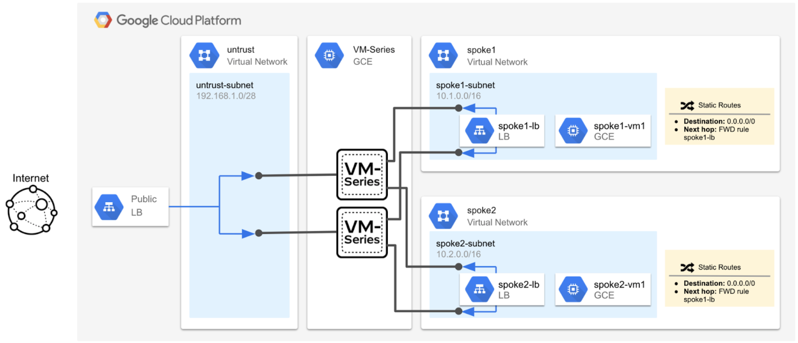

_Table 1. VPC Network Description_

<table>
  <tr>
   <td><strong>VPC Network</strong>
   </td>
   <td><strong>Purpose</strong>
   </td>
  </tr>
  <tr>
   <td>Management
   </td>
   <td>The management VPC (not depicted in diagram) hosts the VM-Series management interfaces.  The management interfaces are used to access the VM-Series user interface or terminal console.
   </td>
  </tr>
  <tr>
   <td>Untrust
   </td>
   <td>The VM-Series 1st datpalane interfaces (untrust - ethernet1/1) reside in the untrust network.  Each of the VM-Series untrust interfaces have an associated public IP address.  The public IP addresses are used to provide outbound internet access for private resources the spoke VPC networks.  
<p>
The untrust interface also serves as the backendl of an external TCP/UDP load balancer.  The load balancer distributes internet inbound requests to the VM-Series untrust interfaces.  The VM-Series inspects and translates the traffic to the appropriate spoke address. 
   </td>
  </tr>
  <tr>
   <td>Spoke1
   </td>
   <td>The VM-Series 2nd dataplane interfaces (trust-ethernet1/2) reside in the spoke1 VPC network.   The interfaces serve as the backend of an internal TCP/UDP load balancer.  A default route sends all spoke1 egress traffic to the forwarding rule on the spoke1 internal load balancer. 
   </td>
  </tr>
  <tr>
   <td>Spoke2
   </td>
   <td>The VM-Series 3nd dataplane interfaces (trust-ethernet1/3) reside in the spoke2 VPC network. The interfaces serve as the backend of an internal TCP/UDP load balancer.  A default route sends all spoke2 egress traffic to the forwarding rule on the spoke2 internal load balancer. 
   </td>
  </tr>
</table>


## Build the Blueprint

In this section, we will deploy the blueprint with Terraform.  Please note, after the build completes, the virtual machines will take an additional 10 minutes to finish their boot-up process. 

1. Open Google Cloud Shell.

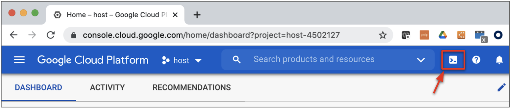

2. In cloud shell, copy and paste the following to enable the required Google Cloud APIs and to create an SSH key.

```
gcloud services enable compute.googleapis.com
ssh-keygen -f ~/.ssh/gcp-demo -t rsa -C gcp-demo
```

**Note.** If you are using a SSH key name that is different from `gcp-demo` name, you must modify the `public_key_path` variable in your terraform.tfvars file to match the name of the key you created. 

3. Copy and paste the following to clone the repository and to apply the Terraform plan.

```
git clone https://github.com/wwce/google-cloud-vmseries-builds
cd google-cloud-vmseries-builds/blueprints/vmseries-hub-spoke-multi-nic
terraform init
terraform apply
```

4. Verify that the Terraform plan will create 52 resources. Enter `yes` to start the build.

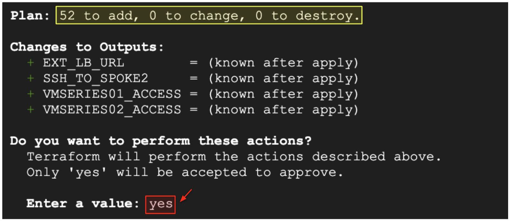

5. Once the build completes, the following output will be generated.  

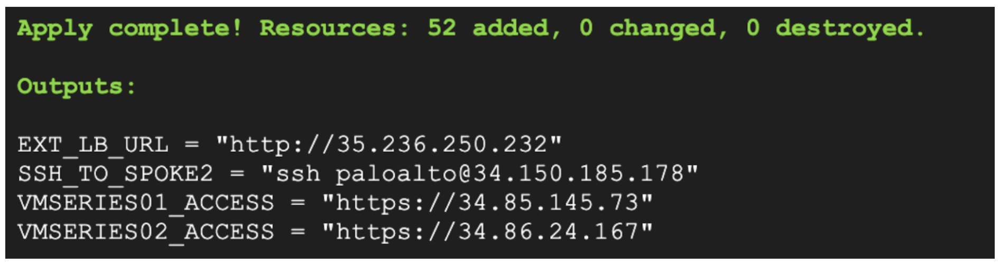

## Verify Completion 

1. The virtual machines in this lab can take up to 10 minutes to finish booting.  

2. Copy and paste the `VMSERIES01_ACCESS` and `VMSERIES02_ACCESS` output values into separate web browser tabs.

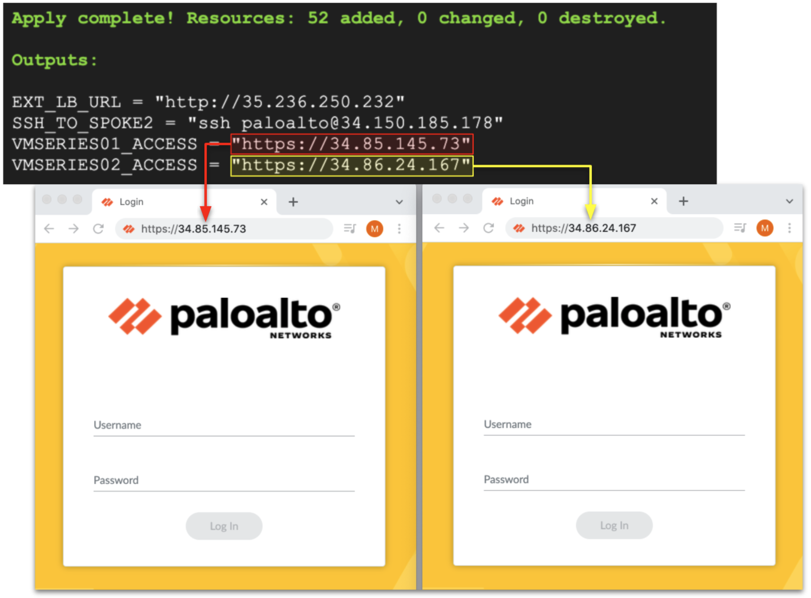

3. Once you receive the Palo Alto Networks VM-Series login page, use the credentials below to log into the firewalls.

```
Username: paloalto
Password: Pal0Alt0@123
```

## Internet Inbound Traffic 

In this section, we will demonstrate internet inbound traffic through the VM-Series to a web application hosted in spoke1 network.  The inbound request will be distributed by the external TCP/UDP load balancer to one of the VM-Series firewall’s untrust interfaces.  The VM-Series then inspects and applies a destination and source network address translation (NAT) policy to the traffic.  

_Inbound: Client-to-Server Request Path_

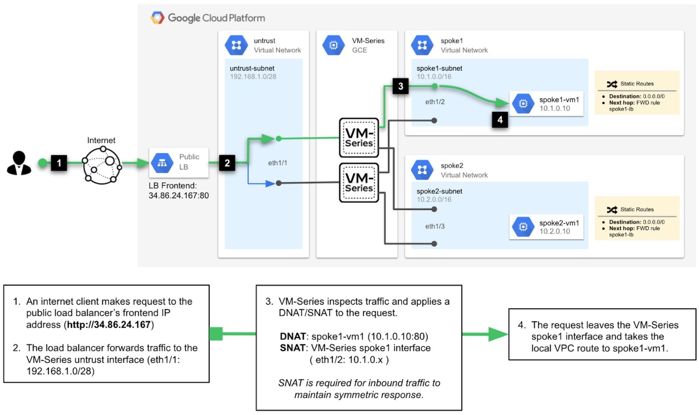

_Inbound: Server-to-Client Response Path_

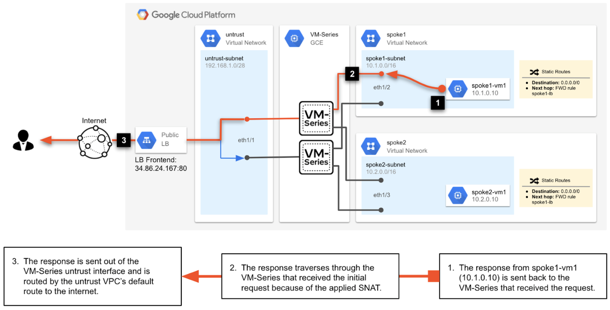

1. Copy and paste the `EXT_LB_URL` output value into a web browser.   The URL resolves to an internal web application (spoke1-vm1, 10.1.0.10) hosted in the spoke1 network. 

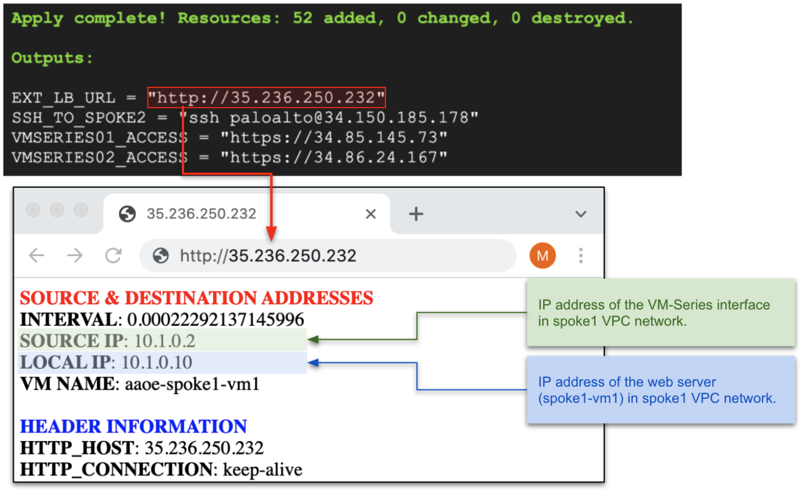

2. The `SOURCE IP` value displays the VM-Series interface address in the spoke1 VPC network.  Try refreshing the web-page several times.  The `SOURCE IP` value will eventually change.  This demonstrates the traffic distribution between the external load balancer and the VM-Series firewalls. 

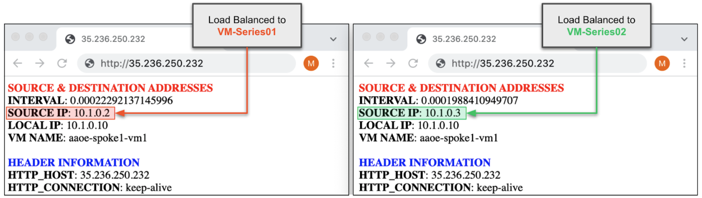

3. On both VM-Series firewalls, navigate to **Monitor → Traffic**

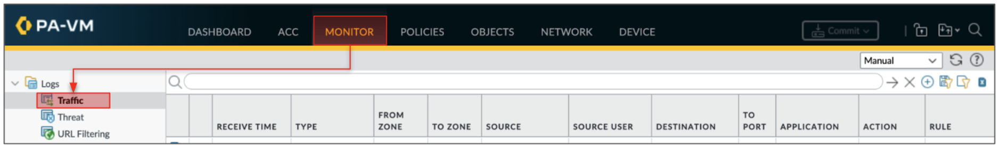

4. View your inbound web request in the traffic logs.  Enter the filter below into the log search bar.  This will filter for logs that match the inbound web request. 

```
( zone.src eq untrust ) and ( zone.dst eq trust ) and ( app eq web-browsing )
```

_Traffic Logs vmseries01_

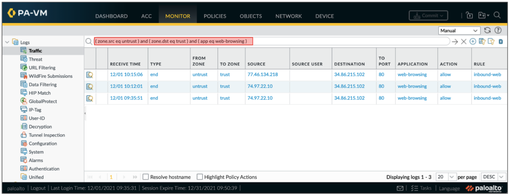

_Traffic Logs vmseries02_

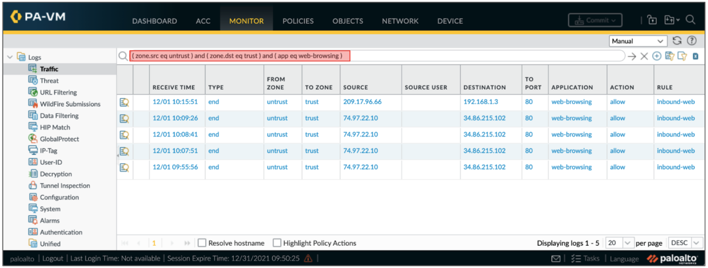


## Internet Outbound Traffic

In this section, we will demonstrate internet outbound traffic from the spoke networks through the VM-Series firewalls.  Each spoke network has a default route pointing to an internal load balancer that frontends the VM-Series dataplane interfaces (ethernet1/2 and ethernet1/3).  When the VM-Series receives an outbound request, the firewall will inspect and translate the traffic to its untrust interface. 

_Outbound: Client-to-Server Request Path_

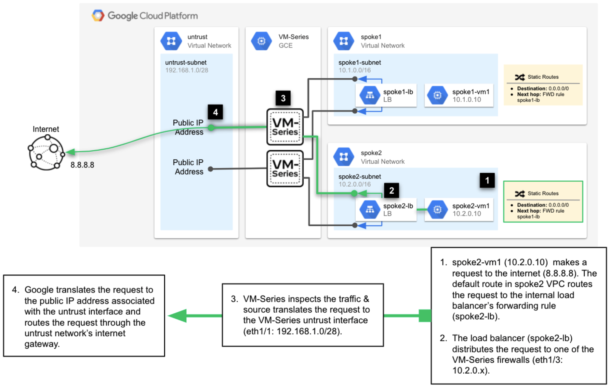

_Outbound: Server-to-Client Response Path_

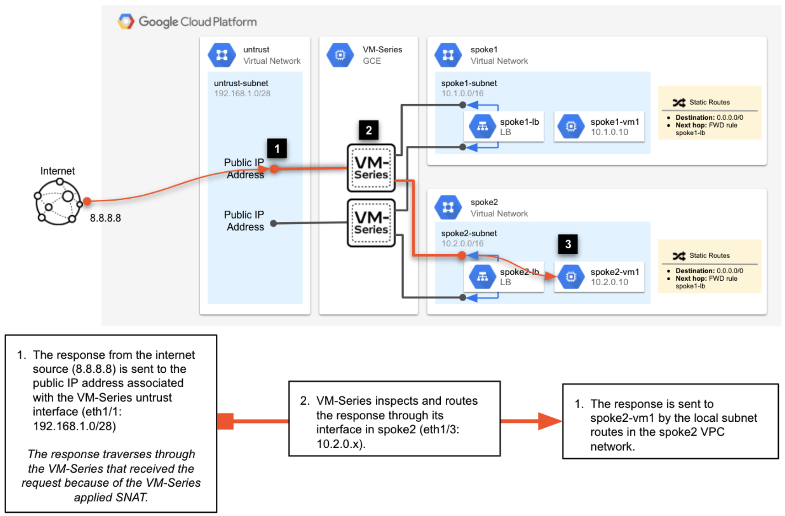


1. Open an SSH session with the spoke2-vm1 instance.  Copy and paste the `SSH_TO_SPOKE2` output value into cloud shell.  

    Similar to the inbound web traffic example, the SSH address is a public IP associated with the external load balancer.  The load balancer will distribute the session to one of the VM-Series firewalls for inspection.

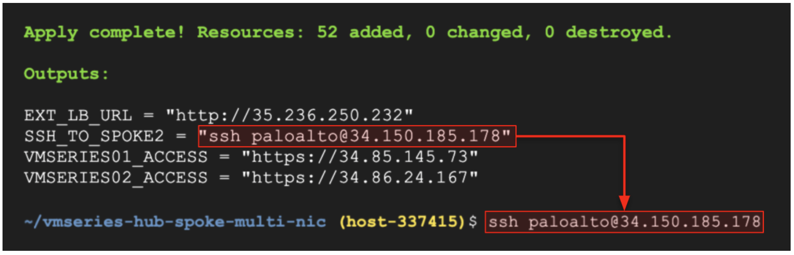

```
Password: Pal0Alt0@123
```

2. Generate outbound internet traffic by running the following.

```
sudo apt update
sudo apt install traceroute
traceroute www.paloaltonetworks.com
```

3. On both VM-Series, go to **Monitor → Traffic** to view the outbound traffic.   

4. Enter the filter below into the log search bar.  This will filter for logs that match the outbound traffic.

```
( addr.src in 10.2.0.10 ) and ( app eq traceroute ) or ( app eq apt-get )
```

5. In this particular example, we can see that vmseries01 received the apt-get request from the internal TCP/UDP load balancer and vmseries02 received the traceroute request.  This demonstrates the load balancing capability between the VM-Series firewall and the Google Cloud internal load balancers.

_Traffic Logs - vmseries01_

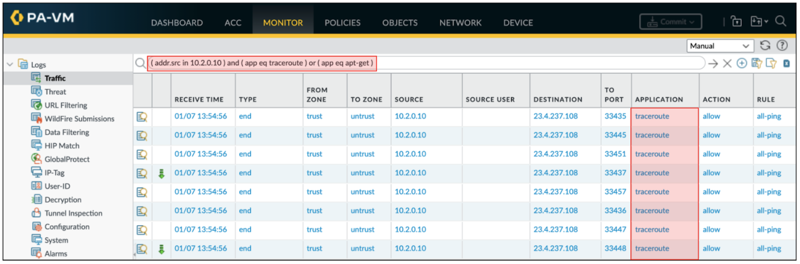

_Traffic Logs vmseries02_

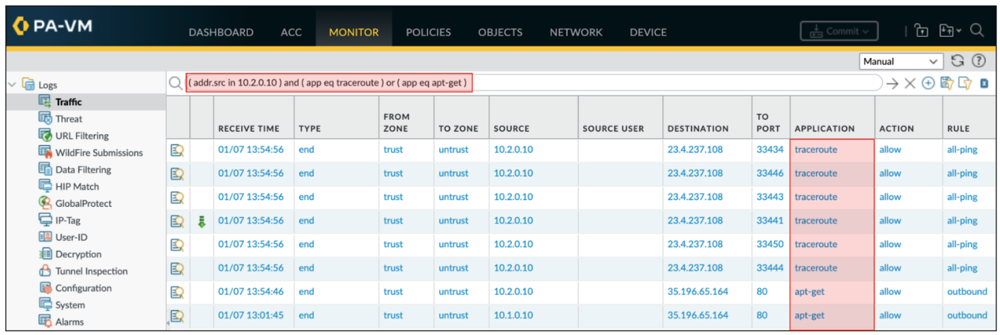


## East-West Traffic

Now we will demonstrate east-west inspection for traffic between the spoke VPC networks.  The east-west flow is identical to the internet outbound flow as described in the previous section.  However, instead of routing the spoke request through the untrust interface, we will route the request through the VM-Series dataplane interface in the adjacent VPC network.  

_East-West: Client-to-Server Request Path_ \

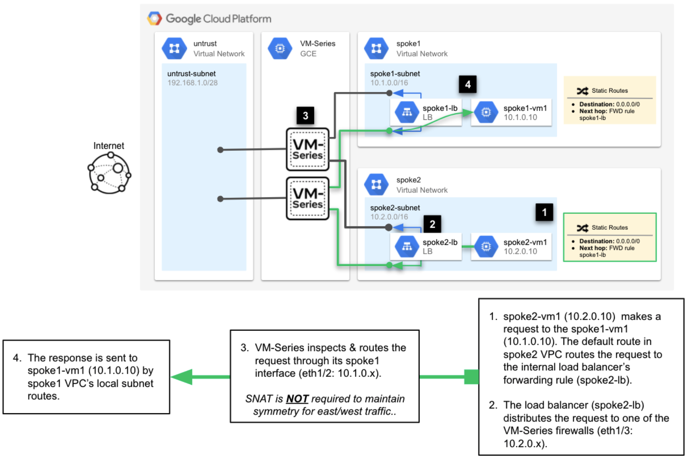

_East-West: Server-to-Client Response Path_

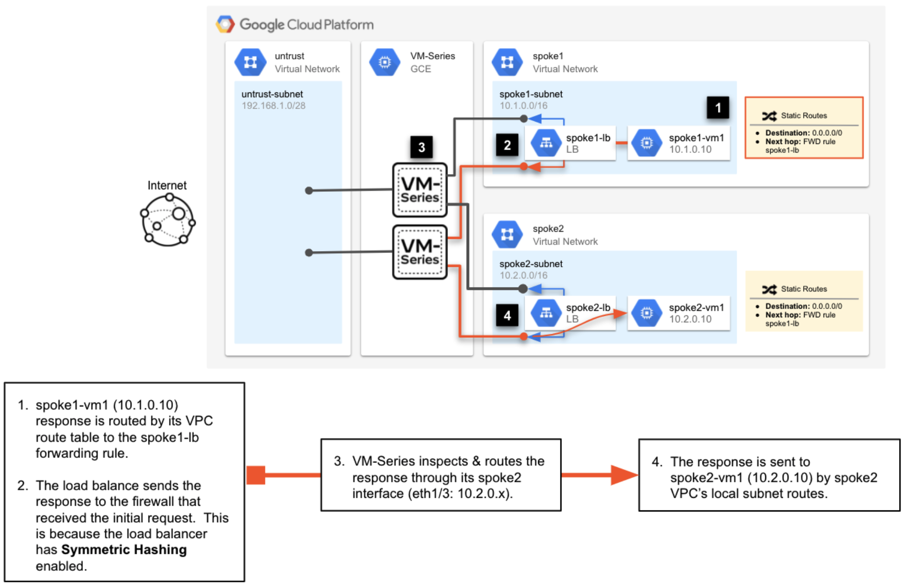

1. While logged into the spoke2-vm1, launch a repeat curl to the web service running on spoke1-vm1.

```
curl http://10.1.0.10/?[1-100]
```

2. On both VM-Series, go to **Monitor → Traffic** to view the east-west traffic.   

3. Enter the filter below into the log search bar.  This will filter for all traffic between spoke2-vm1 and spoke1-vm1.

```
( addr.src in 10.2.0.10 ) and  ( addr.dst in 10.1.0.10 )
```

_Traffic Logs vmseries01_

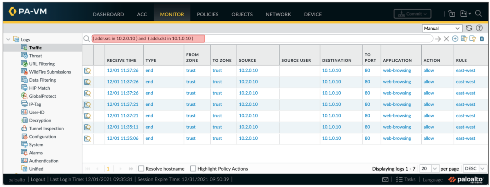

_Traffic Logs vmseries02_

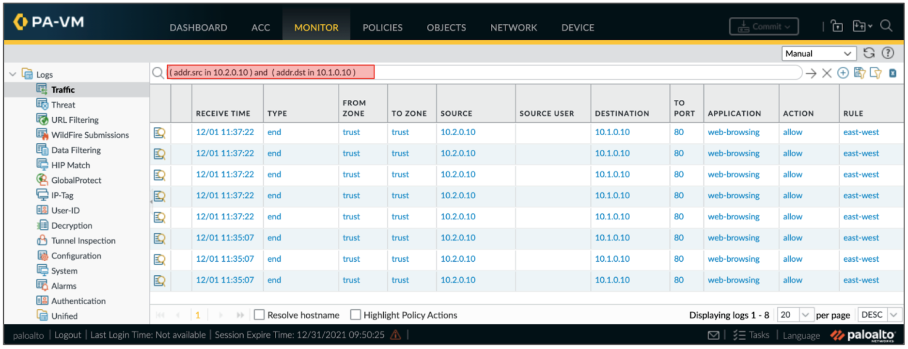


## Destroy Environment

If you would like to destroy the environment, from the cloud shell build directory, enter the following. 

```
terraform destroy -auto-approve
rm ~/.ssh/gcp-demo
```


## Conclusion

You have completed the build.  You have learned how to secure a hub and spoke architecture using multi-NIC VM-Series firewalls. 
