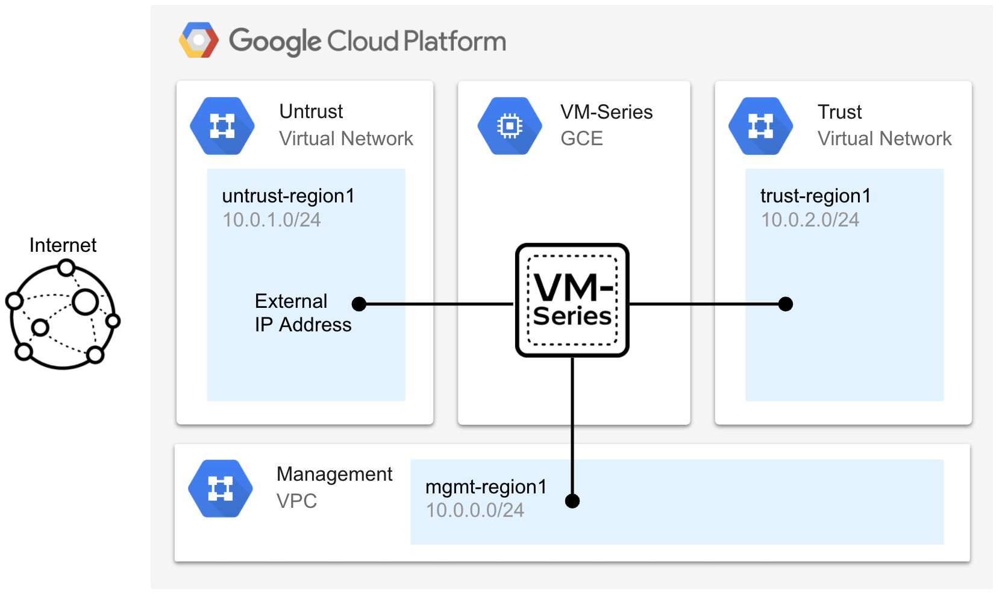

# VM-Series Blueprint: Standalone VM-Series in Unmanaged Instance Group

## Overview

This build creates a single VM-Series firewall in an unmanaged instance group.  The build creates 3 new VPC networks (management, untrust, and trust) with subnets to host the VM-Series interfaces. The management network allows TCP/22 and TCP/443 from all source IPs by default.  The source IP address range can be locked down by setting value(s) to the mgmt_sources variable in the terraform.tfvars file. 


## Topology

<p align="center">
    
</p>

## Build

In this section, we will deploy the blueprint with Terraform. Please note, after the build completes, the virtual machines will take an additional 10 minutes to finish their boot-up process. 

1. Open Google cloud shell.

<p align="center">
    
</p>

2. In cloud shell, copy and paste the following to enable the required Google Cloud APIs and to create an SSH key.

```
gcloud services enable compute.googleapis.com
ssh-keygen -f ~/.ssh/gcp-demo -t rsa -C gcp-demo
```

<span style="color:red">**Note.** If you are using a SSH key name that is different from the `gcp-demo` name, you must modify the `public_key_path` value in your terraform.tfvars file to match the name of the key you created.</span>

3. Copy and paste the following to clone the repository and to apply the Terraform plan.

```
git clone https://github.com/wwce/google-cloud-vmseries-builds
cd google-cloud-vmseries-builds/blueprints/vmseries-hub-spoke-vpc-peering
terraform init
terraform apply
```

4. Verify that the Terraform plan will create `17` resources. Enter `yes` to start the build.

5. When the build completes, the following output will be displayed.  The outputs provide access to the VM-Series firewall's user interface and terminal console. 

```

```